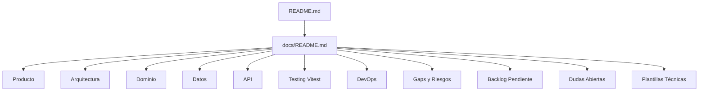

# Guardián del Bosque

Documentación integral del proyecto para desarrollo asistido por IA, trazabilidad en GitHub y ejecución por fases.

## Inicio rápido de documentación

- Índice general: [docs/README.md](docs/README.md)
- Plan documental y transición: [plans/docs/documentation-plan.md](plans/docs/documentation-plan.md)
- Guía de contribución: [CONTRIBUTING.md](CONTRIBUTING.md)

## Objetivo del repositorio

Este repositorio centraliza especificación funcional, técnica y operativa del simulador serio de prevención de incendios **Guardián del Bosque**, con enfoque en:

- Arquitectura hexagonal + DDD + CQRS
- Integración geoespacial (MapLibre + PostGIS)
- Calidad y pruebas estandarizadas en **Vitest**
- Flujo GitHub-first para trabajo humano + IA

## Mapa de documentación

## Estado

La documentación está preparada para que un agente IA pueda ejecutar trabajo incremental con criterios de aceptación, riesgos explícitos y trazabilidad.

