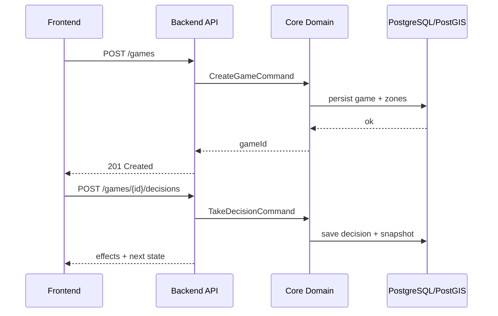

# API y Contratos

## Estilo de API

- Transporte principal: HTTP JSON.
- Contrato versionado por OpenAPI en `packages/api-contracts`.
- Convención de errores estable y trazable.

## Recursos principales

- `/games`
- `/games/{id}`
- `/games/{id}/decisions`
- `/games/{id}/heatmap`
- `/scenarios`
- `/scenarios/{id}/zones`

## Flujo básico de partida



## Política de errores

Formato recomendado:

```json
{
  "error": "DECISION_FAILED",
  "message": "Recursos insuficientes",
  "details": {
    "gameId": "...",
    "nodeId": "..."
  }
}
```

## Reglas de compatibilidad

- Cambios breaking requieren versionado explícito.
- Nuevos campos deben ser backward-compatible.
- Respuestas de error no deben romper estructura base.

