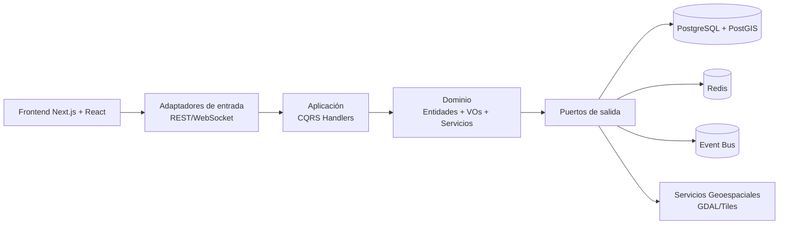

# Arquitectura del Sistema

## Decisión arquitectónica base

Se adopta **Arquitectura Hexagonal + DDD + CQRS** en monorepo para separar:

- núcleo de dominio (reglas de negocio puras),
- casos de uso,
- adaptadores de entrada/salida,
- y detalles de infraestructura.

## Vista de alto nivel

## Estructura recomendada de monorepo

- `packages/core`: dominio + aplicación
- `packages/infrastructure`: adaptadores, DB, mensajería
- `packages/frontend`: aplicación web
- `packages/shared`: tipos/constantes compartidas
- `packages/api-contracts`: OpenAPI/contratos
- `packages/tools`: herramientas de datos

## Justificación técnica

- Reduce acoplamiento y facilita pruebas aisladas.
- Permite paralelizar equipos (frontend/backend/core).
- Facilita evolución incremental por issues pequeños.
- Escala bien para ejecución asistida por IA con interfaces claras.

## Riesgos y mitigación

- **Riesgo:** sobreingeniería temprana.
  - **Mitigación:** implementar por vertical slices y no por “capas completas”.
- **Riesgo:** complejidad de CQRS sin necesidad.
  - **Mitigación:** aplicar CQRS solo en agregados críticos.

