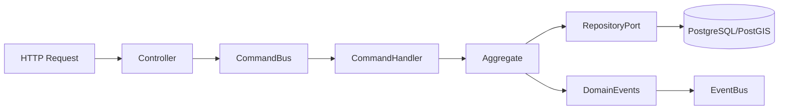

# Especificación Backend

## Stack actualizado

- Node.js LTS
- Fastify
- TypeScript
- Prisma + PostgreSQL/PostGIS
- Redis (cache)
- Event bus (in-memory/RabbitMQ según entorno)

## Capas

- Entrada: REST/WebSocket
- Aplicación: comandos/queries (CQRS)
- Dominio: entidades/agregados/servicios
- Infraestructura: repositorios/adaptadores

## Flujo de comando

## Requisitos no funcionales

- Validación de entrada estricta.
- Manejo de errores con códigos estables.
- Logging estructurado por request.
- Endpoint de healthcheck.

