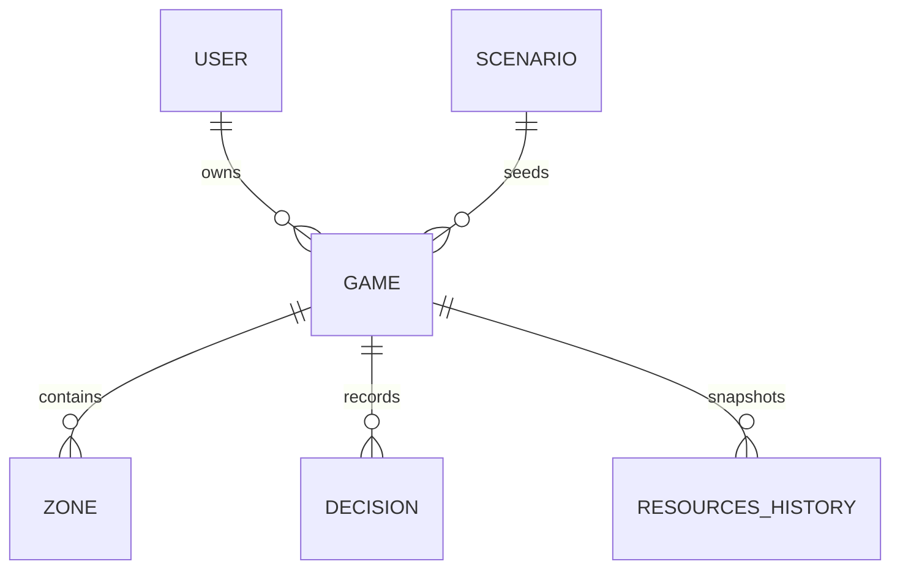

# Modelo de Datos y Geoespacial

## Principios

- Fuente de verdad transaccional: PostgreSQL.
- Capacidades espaciales: PostGIS.
- Contratos de intercambio: JSON Schema/OpenAPI.

## Entidades persistentes

- `Game`
- `Zone`
- `Decision`
- `ResourcesHistory`
- `Scenario`
- `SystemEvent`

## Relación principal

## Campos geoespaciales

- `Zone.geometry`: `geometry(Polygon,4326)`
- Índice espacial recomendado: `GIST(geometry)`
- Consultas críticas:
  - contención por punto,
  - adyacencia,
  - distancia entre zonas.

## Consistencia de datos

- Snapshot de recursos en cada decisión.
- Registro de eventos de sistema para auditoría.
- Versionado de escenarios para reproducibilidad.

