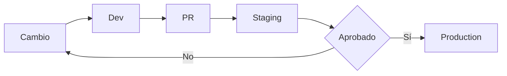

# CI/CD y Estrategia de Entornos

## Entornos

- **Development**: validación local y pruebas rápidas.
- **Staging**: validación integrada por PR.
- **Production**: despliegue controlado con smoke tests.

## Flujo obligatorio

## Pipeline recomendado

1. Lint + typecheck.
2. Vitest unit/integration/contract.
3. Build artefactos.
4. Deploy staging.
5. Smoke tests.
6. Aprobación y deploy producción.

## Evidencia mínima en GitHub

- Link al run de Actions.
- Resumen en Markdown de resultados.
- Riesgo y rollback por PR.

