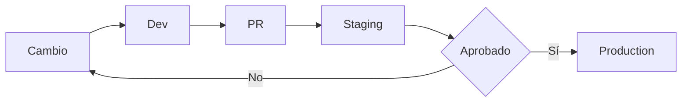

# CI/CD y Estrategia de Entornos

## Entornos

La topología, el proveedor y las puertas de exposición pública se fijan en [`publication-and-hosting-decision.md`](publication-and-hosting-decision.md). El despliegue inicial usa un único Render Web Service para toda la aplicación Fastify.

- **Development**: validación local y pruebas rápidas.
- **Staging**: validación integrada por PR.
- **Production**: despliegue controlado con smoke tests.

## Flujo obligatorio

```mermaid
flowchart LR
    A[Cambio] --> B[Dev]
    B --> C[PR]
    C --> D[Staging]
    D --> E{Aprobado}
    E -->|Sí| F[Production]
    E -->|No| A
```

## Pipeline recomendado

1. Lint + typecheck.
2. Vitest unit/integration/contract.
3. Build artefactos.
4. Deploy staging.
5. Smoke tests.
6. Aprobación y deploy producción.

## Evidencia mínima en GitHub

- Link al run de Actions.
- Resumen en Markdown de resultados.
- Riesgo y rollback por PR.

Un run correcto no autoriza por sí solo publicación pública: también deben cumplirse #76, la revisión experta #99, las pruebas ciudadanas #100 y las puertas editoriales, operativas y de seguridad de la decisión de alojamiento.

