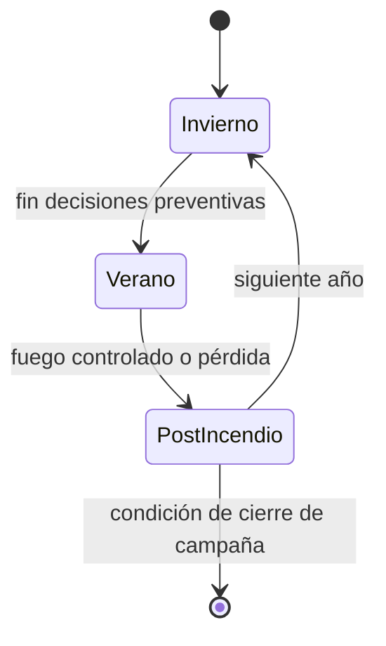

# Dominio del Juego y Reglas

## Bucle principal

## Entidades y conceptos clave

- **GameSession**: agregado raíz de la partida.
- **ForestZone**: zona geoespacial con propiedades dinámicas.
- **DecisionNode / DecisionOption**: árbol de decisiones de temporada.
- **ResourceAllocation**: recursos disponibles y restricciones.
- **HeuristicState**: estado acumulado de riesgo y propagación.

## Reglas de negocio mínimas

1. Ninguna decisión puede dejar recursos críticos en negativo (salvo reglas explícitas de deuda).
2. Toda transición de temporada debe registrar snapshot de estado.
3. La propagación de incendio depende de combustible, humedad, pendiente y viento.
4. Las decisiones de invierno alteran la dificultad del verano.
5. Toda decisión emitirá evento de dominio auditable.

## Condiciones sugeridas de victoria/derrota

- **Victoria:** bosque afectado < 20% y recursos estratégicos > 0 al final del ciclo.
- **Derrota:** bosque afectado >= 80%, o colapso operativo sostenido.

## Eventos de dominio

- `GameStarted`
- `DecisionTaken`
- `SeasonChanged`
- `FireStarted`
- `FirePropagated`
- `GameEnded`

