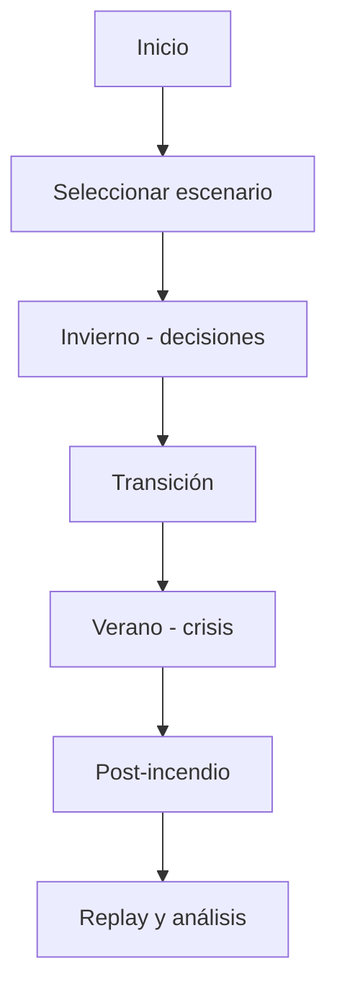

# Especificación Frontend

## Stack actualizado

- Next.js (App Router)
- React
- TypeScript
- Zustand para estado cliente
- MapLibre GL + Turf.js para visualización/operación geoespacial

## Módulos principales

- UI shell (layout, navegación, notificaciones)
- Mapa interactivo (zonas, perímetro, heatmap)
- Panel de decisión (invierno/verano)
- Dashboard de recursos
- Post-mortem/replay

## Flujo de UI

## Criterios de UX

- Feedback inmediato de efectos al decidir.
- Explicabilidad de cambios heurísticos.
- Modo accesible (teclado, contraste, escala).
- Persistencia de partida local y sincronizable.

