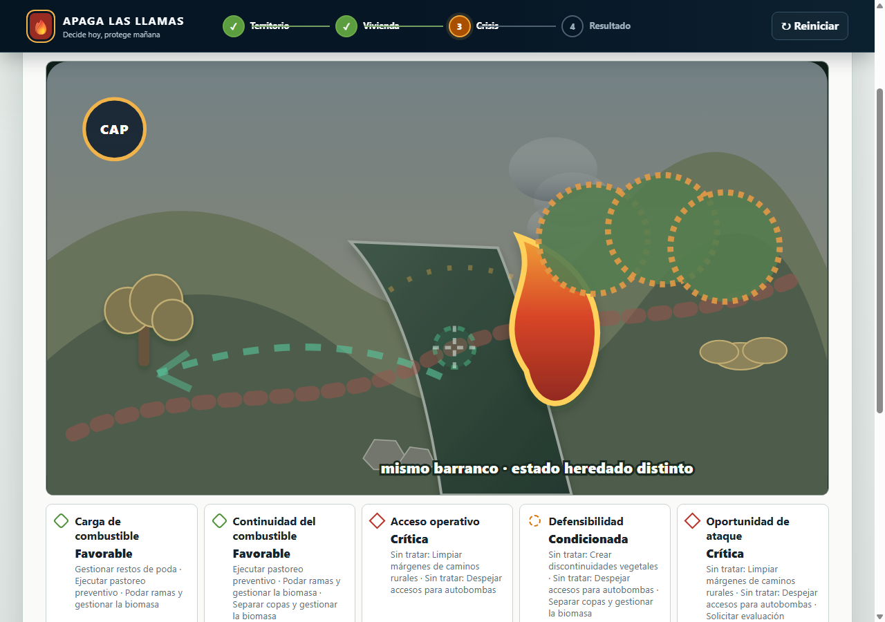
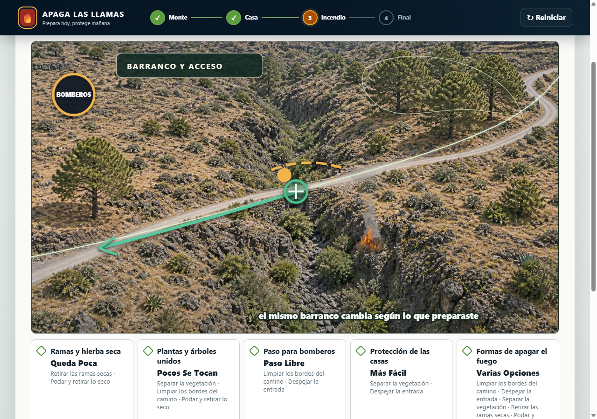
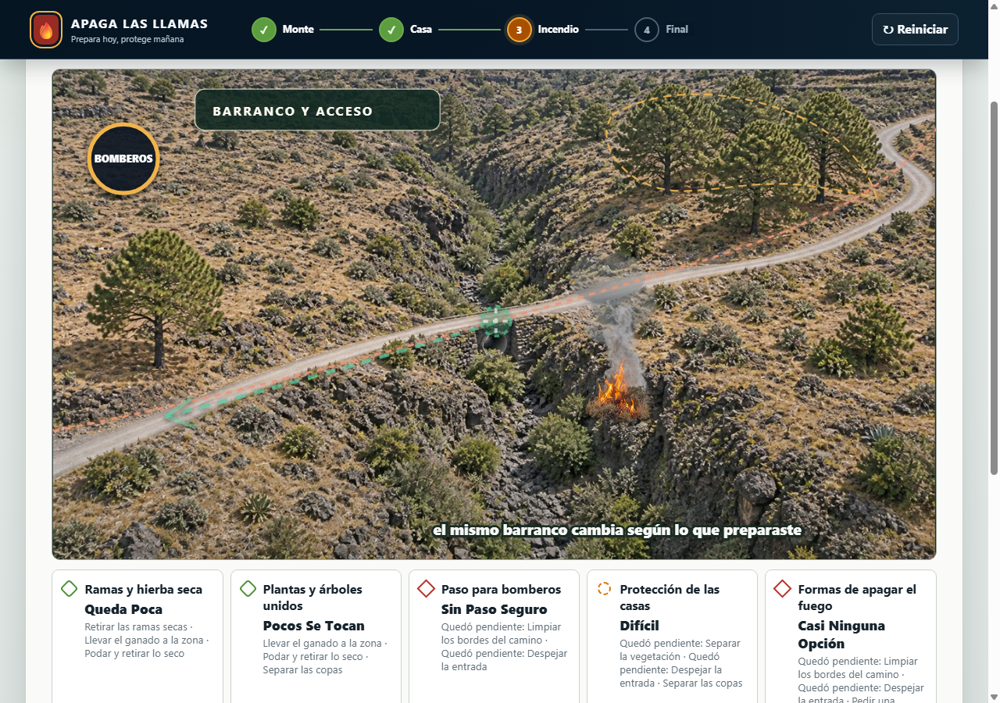
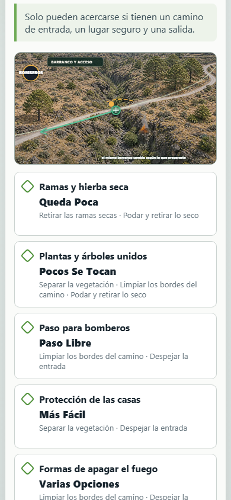
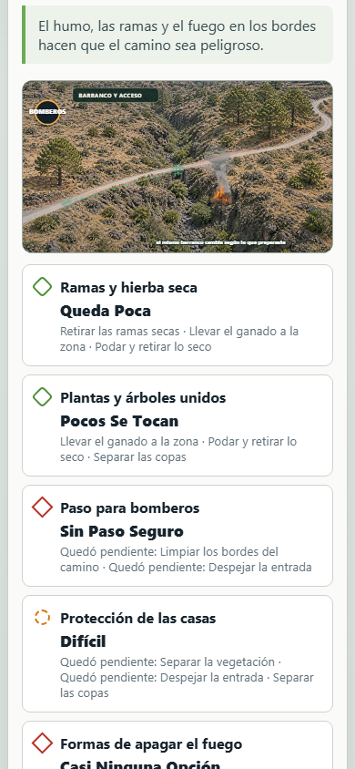

# Barranco y acceso en la fase de crisis

## Problema

La escena anterior dibujaba el barranco, la vía y la vegetación con formas vectoriales abstractas. El fuego y los marcadores dominaban el paisaje, por lo que costaba reconocer el paso real del barranco y entender que los estados preparado y vulnerable describen condiciones distintas sobre el mismo lugar.

## Comportamiento resultante

Una fotografía aérea original y neutral muestra el barranco volcánico, la vía rural, su paso y las copas próximas. La misma imagen se reutiliza en todas las rutas. Encima se mantienen como SVG generado desde el estado real del juego:

- la disponibilidad o bloqueo de la vía;
- la ruta de repliegue y la posición operativa;
- la presión del incendio y su humo;
- la oportunidad de ataque, el riesgo de copas y la capacidad operativa.

La foto base no contiene fuego, equipos, símbolos ni una intervención ya ejecutada. Por tanto, no anticipa consecuencias ni confunde una evaluación con una actuación. El fuego se añade como recorte fotográfico con transparencia, humo y matorral a escala; su tamaño depende del estado de presión.

Las copas ya no se sustituyen por círculos sintéticos: una máscara orgánica y semitransparente sigue la masa arbórea que ya existe en la fotografía. El acceso tampoco se redibuja como una cadena de trazos gruesos; una línea de estado fina, acompañada por un halo discreto, sigue el eje de la carretera fotografiada. Así se conserva la lectura del lugar real y se comunica el estado sin competir con la imagen.

El marcador dice «BOMBEROS» y las tarjetas explican las condiciones con frases como «paso libre», «sin paso seguro» o «muchos se tocan». No se muestra vocabulario interno del motor ni una puntuación numérica.

## Capturas reales de navegador

Las capturas proceden del recorrido automatizado en Chrome mediante `Page.captureScreenshot`; no son renders aislados del SVG.

### Antes

### Después

| Preparado, escritorio | Vulnerable, escritorio |
|---|---|
|  |  |

| Preparado, móvil | Vulnerable, móvil |
|---|---|
|  |  |

## Validación visual

- Escritorio a 1280 × 900 y móvil a 390 × 844.
- Foto completa, sin recortes, barras vacías ni desbordamiento horizontal.
- Recurso JPEG servido correctamente y base idéntica en las rutas preparada y vulnerable.
- Indicador de capacidad con zona táctil mínima de 44 px en móvil.
- Fuego y humo limitados a menos de un tercio de la altura del mapa para que no dominen la escena; vía, repliegue, posición, copas y oportunidad permanecen dentro del lienzo.
- Línea de estado de la carretera limitada a 2,4 px y halo de integración limitado a 7 px.
- Zona orgánica de copas limitada al 34 % del ancho y al 26 % de la altura del mapa; no se renderizan copas circulares artificiales.
- Recorrido completo desde territorio y vivienda hasta ambas variantes de emergencia y el resultado final.

La comprobación de navegador finaliza con `M5_VISUAL_SMOKE_OK`.
