# Decisiones de emergencia e informe final

Issue de referencia: #176. Continuación visual de las escenas fotográficas de territorio, vivienda y barranco.

## Problema

Las decisiones todavía se presentaban como tarjetas grandes separadas del lugar donde ocurría la emergencia. En móvil podían necesitar desplazamiento interno, mientras el mapa quedaba reducido a una franja. Los mensajes, las opciones y la respuesta compartían jerarquía, de modo que no siempre quedaba claro qué había que decidir y qué había ocurrido después.

El resultado final tenía aspecto de panel administrativo. La comparación heredaba colores del fondo oscuro y perdía contraste, y la revisión preventiva expandía la página en mitad del informe.

## Comportamiento resultante

La entrada a la partida se presenta como un briefing de misión sobre la fotografía del puesto de mando. Resume el recorrido «observa, decide y comprueba», muestra el objetivo y mantiene la acción principal dentro del mismo panel, sin una página blanca intermedia.

La emergencia mantiene la fotografía a pantalla completa. La información se separa en tres zonas estables:

- contexto y nivel de la emergencia en la parte superior;
- margen de actuación y condiciones de partida en un bloque independiente;
- decisión operativa en una bandeja inferior compacta, sin menú lateral.

Las elecciones se muestran como módulos numerados de estética táctica. En escritorio se limitan a 180–220 px y se centran; en móvil forman una cuadrícula de dos columnas, con una opción impar centrada y botones táctiles de al menos 44 px. Una decisión con una sola respuesta usa una bandeja específica más estrecha.

Las opciones desaparecen al elegir y dejan paso a una resolución breve. El texto utiliza un tono técnico accesible: explica acceso, posición y salida segura sin vocabulario interno del motor ni frases infantiles. Las alternativas no seguras permanecen visibles como parte del aprendizaje, pero están deshabilitadas y explican el motivo.

Los trazos del barranco, la carretera, la salida y las copas son ahora guías finas que no ocultan la fotografía. En móvil, el mismo paisaje ocupa todo el fondo y la panorámica completa conserva los puntos y proporciones importantes.

El cierre se presenta como un informe de operación de estética coherente con el juego. Distingue condiciones iniciales, relaciones causa-efecto y estado final. El registro de preparación se abre como una ventana superpuesta para consultar medidas aplicadas y condiciones pendientes sin partir el informe. La comparación conserva un fondo claro y contraste propio.

Las tarjetas contextuales usan entrada y salida breves, resaltan el punto que las abrió y buscan la posición con menos solapamientos. El movimiento se desactiva con `prefers-reduced-motion`.

## Capturas reales de navegador

Las capturas proceden del recorrido completo automatizado en Chrome mediante `Page.captureScreenshot`; no son renders aislados del SVG.

### Antes

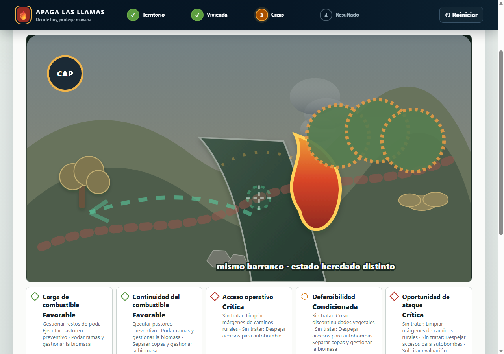

### Briefing y primera orden

| Misión, escritorio | Misión, móvil |
|---|---|
| 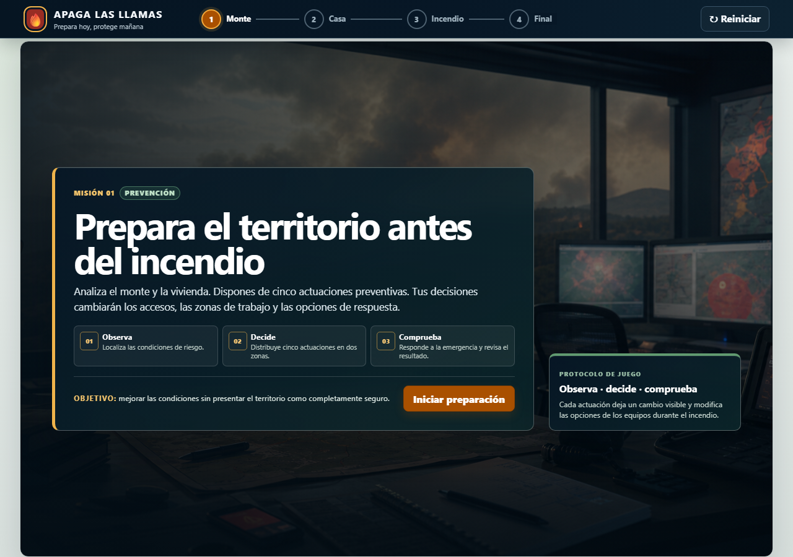 | 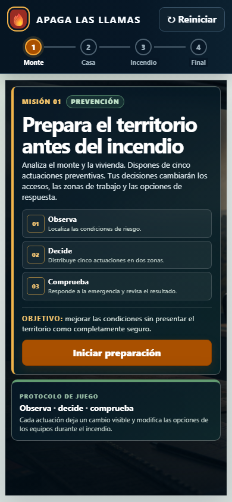 |

| Primera orden, escritorio | Primera orden, móvil |
|---|---|
| 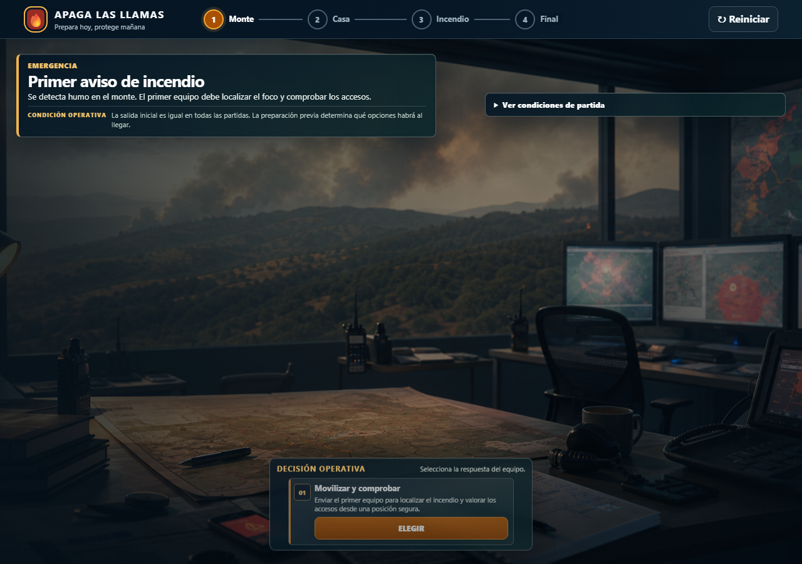 | 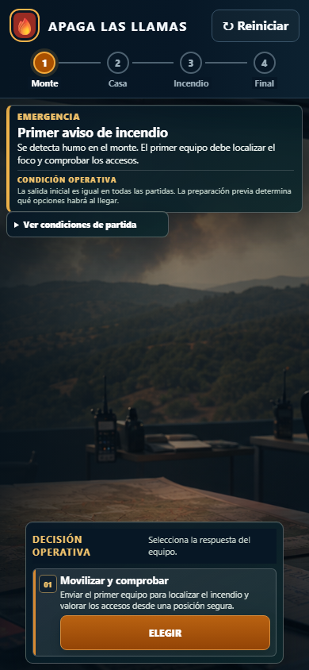 |

### Decisión operativa

| Preparado, escritorio | Preparado, móvil |
|---|---|
| 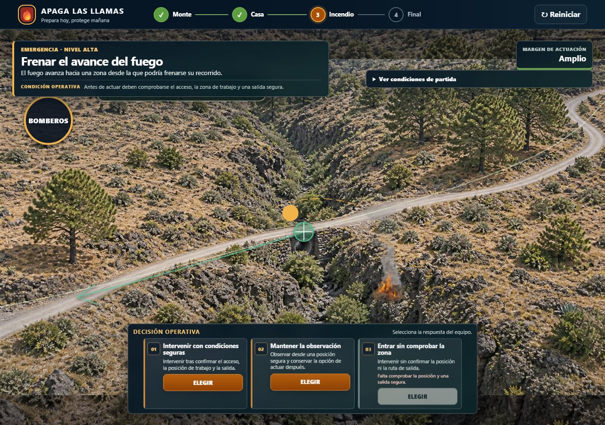 | 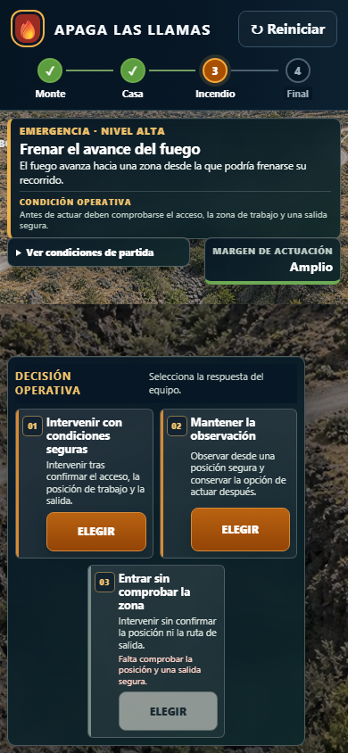 |

| Ruta limitada, escritorio | Ruta limitada, móvil |
|---|---|
| 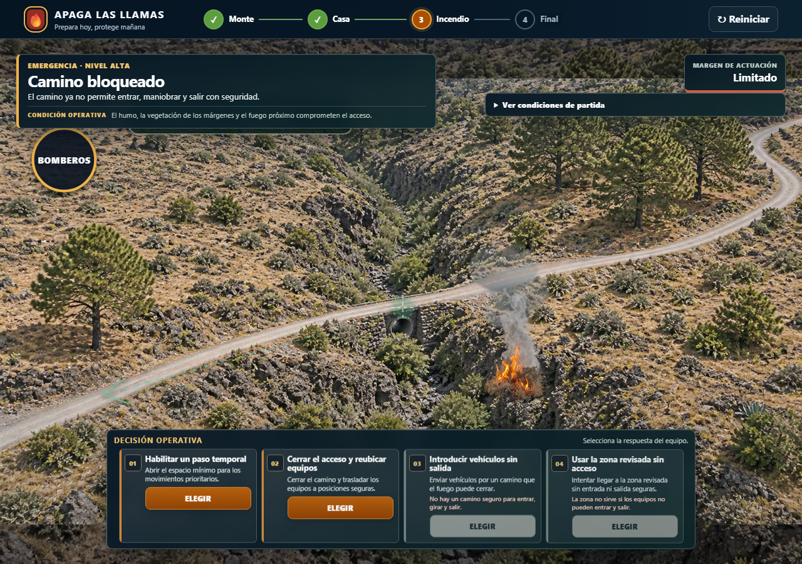 | 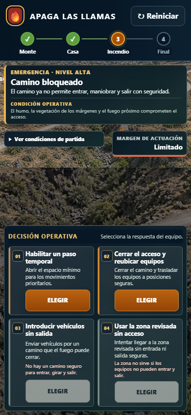 |

La respuesta sustituye a las opciones y mantiene el avance separado:

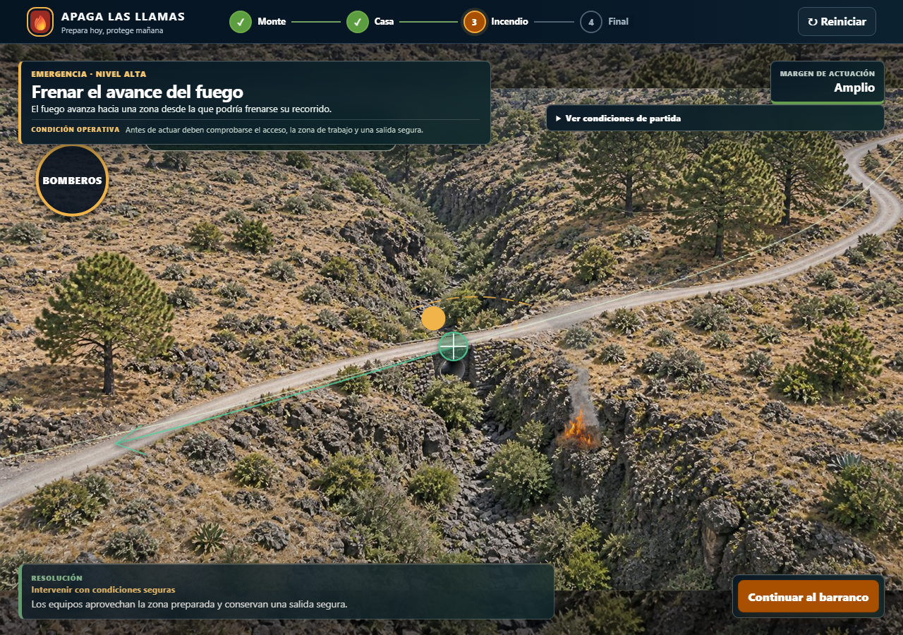

### Informe y revisión

| Informe, escritorio | Informe, móvil |
|---|---|
| 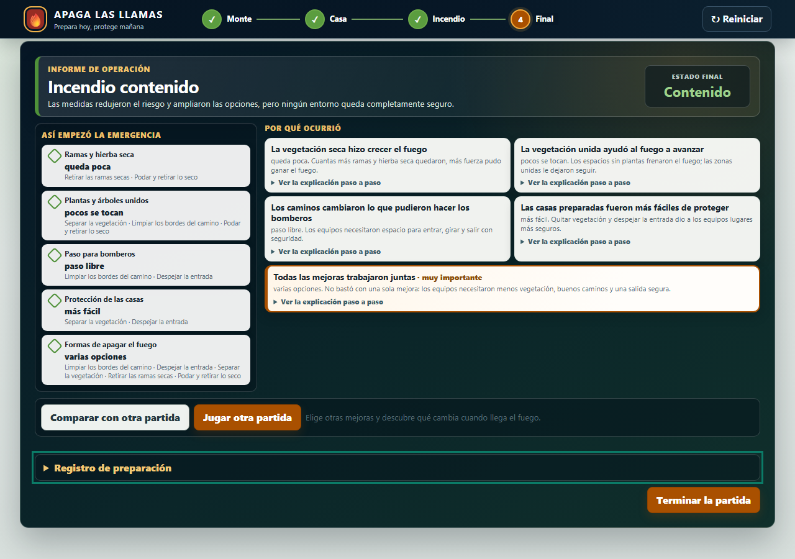 | 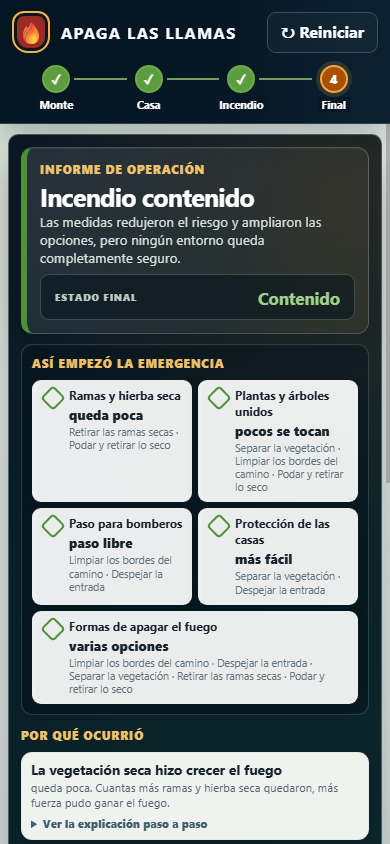 |

| Registro preventivo, escritorio | Registro preventivo, móvil |
|---|---|
| 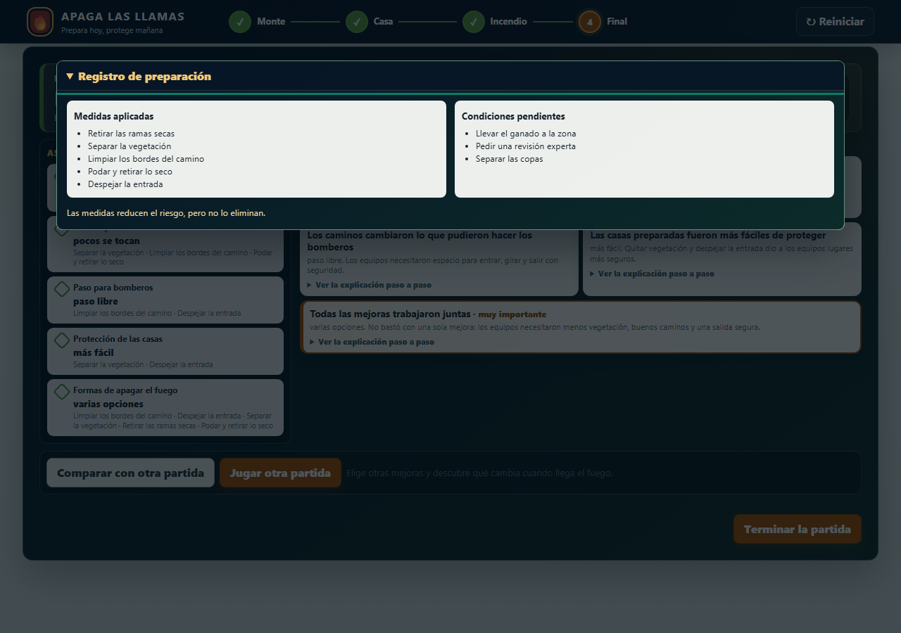 | 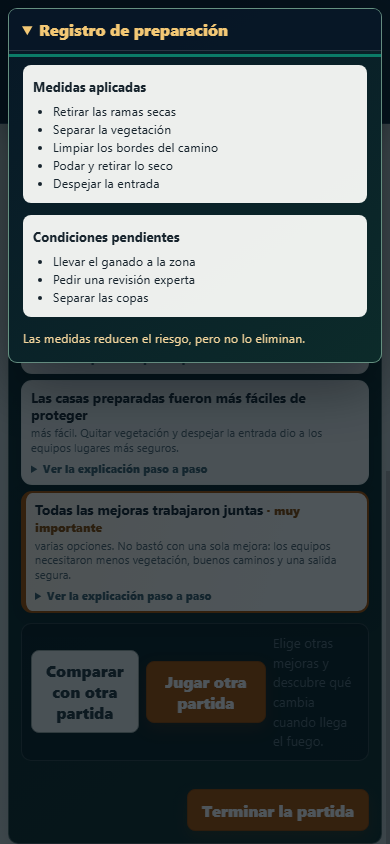 |

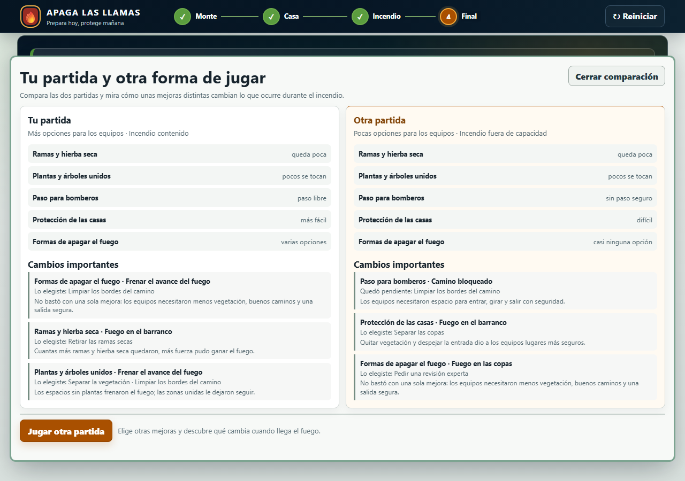

## Validación realizada

- `npm run accept:m5`: 0 vulnerabilidades; 36 archivos y 203 pruebas superadas; aceptación M4 4/4 y M5 4/4.
- Recorrido visual automatizado completo en Chrome: `M5_VISUAL_SMOKE_OK`.
- Escritorio a 1280 × 900 y 1920 × 920; móvil táctil a 390 × 844.
- Ratón, `Tab` + `Enter` y toque comprobados en puntos del mapa y acciones.
- Límites de tres actuaciones en territorio y dos en vivienda verificados antes de avanzar.
- Decisiones de rutas preparada y limitada, sustitución de opciones por resolución, informe, registro y comparación comprobados sin desbordamiento ni scroll interno en los menús.

## Cómo probar

1. Ejecutar `npm ci`, `npm run build` y `npm start`.
2. Completar tres mejoras en territorio y dos en vivienda.
3. En la emergencia, comprobar las opciones con ratón, `Tab` + `Enter` y toque.
4. Elegir una respuesta y verificar que la bandeja se sustituye por «Resolución» y el botón de avance.
5. Llegar al final, abrir «Registro de preparación» y comparar con otra partida.
6. Repetir con menos mejoras para comprobar la ruta limitada.

## Límites conocidos

Los operarios y el rebaño son recortes raster con movimiento CSS, no vídeo ni GIF. Constituyen una primera biblioteca de efectos que puede ampliarse con más equipos, animales y evolución del fuego. La vista móvil conserva la panorámica completa para no perder puntos interactivos y utiliza la misma foto como fondo de continuidad.
