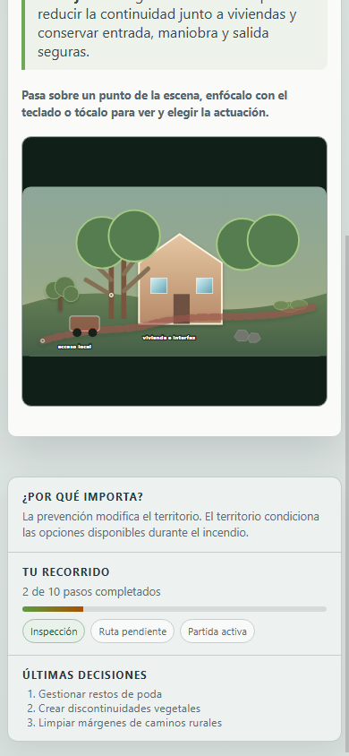
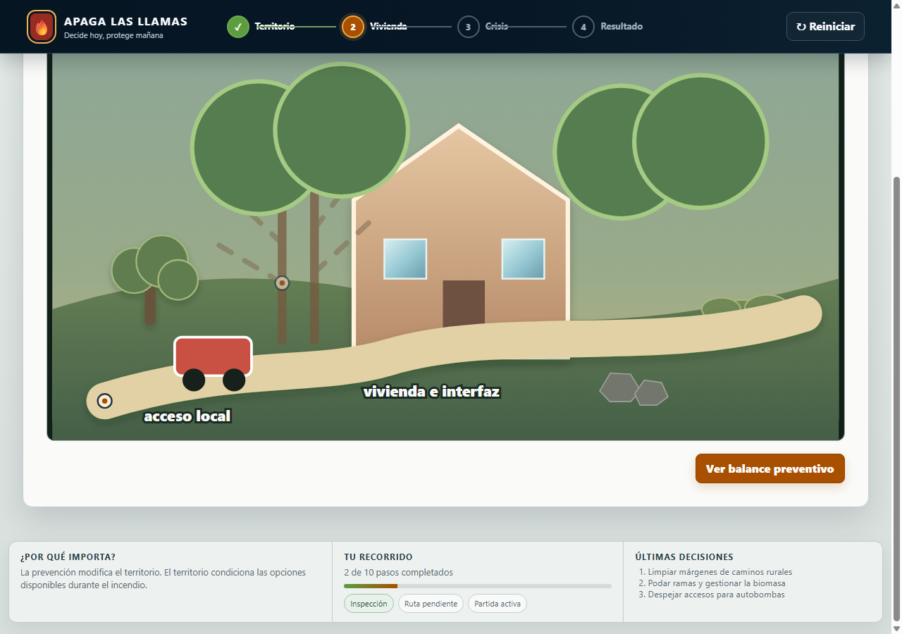
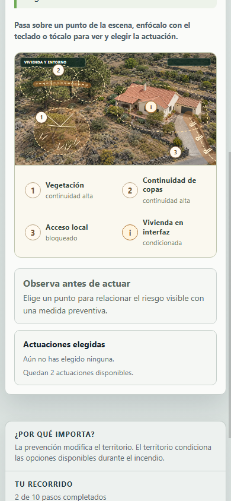
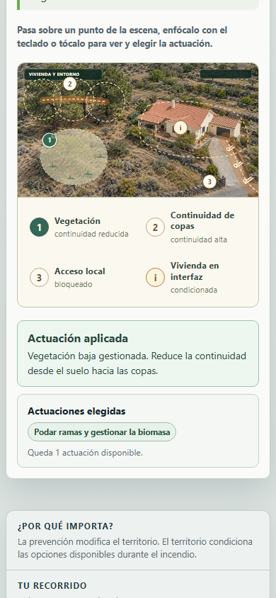
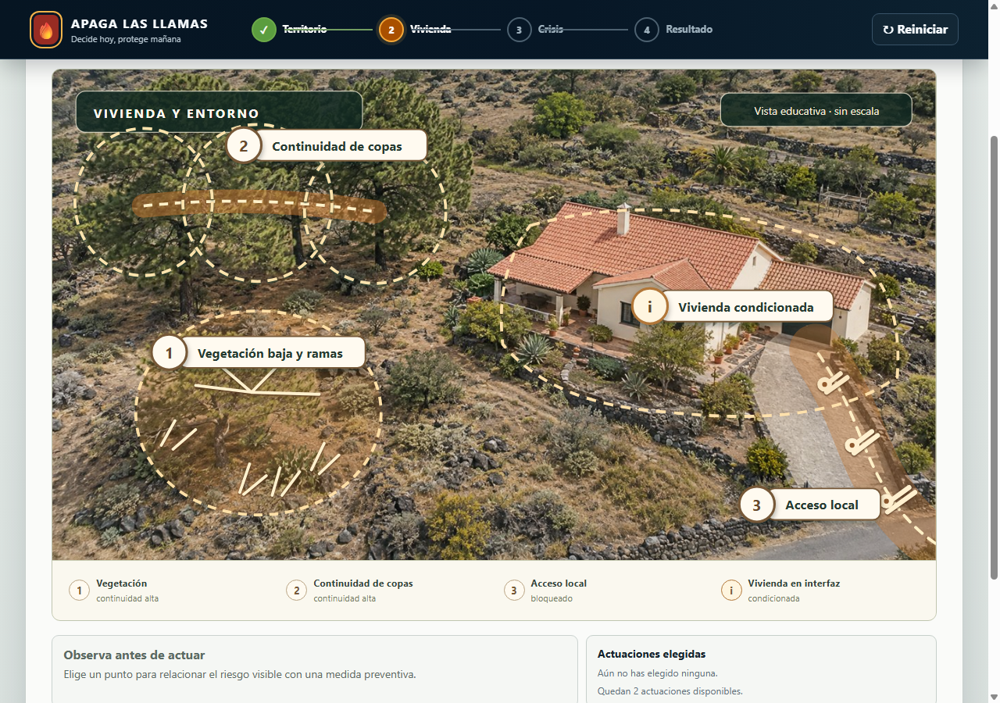
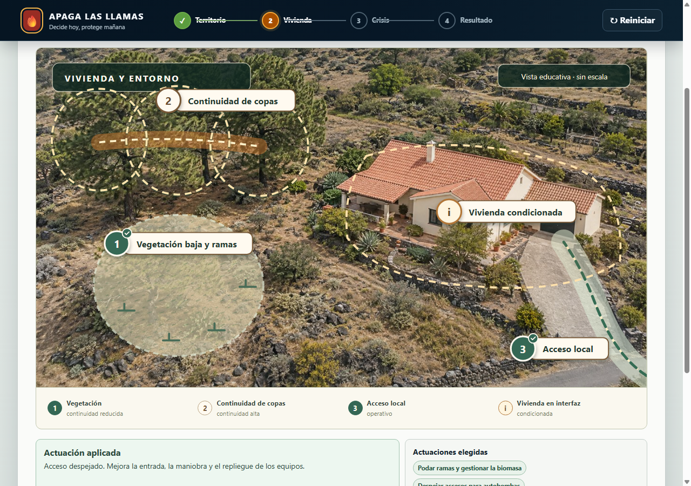
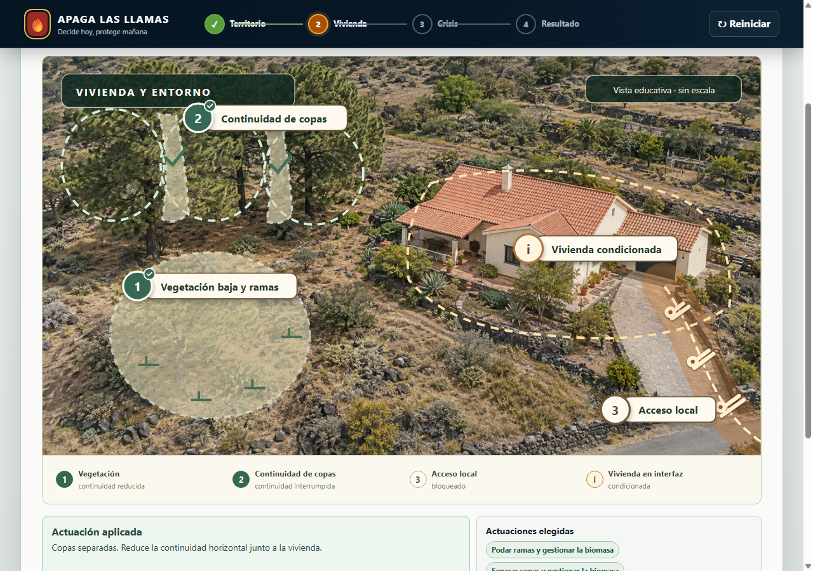
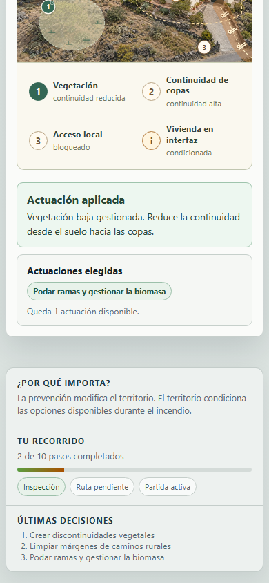

# Prevención alrededor de la vivienda

Issue: #192. Referencia integrada: PR #190.

## Problema

La escena anterior presentaba la vivienda, las copas, las ramas y el acceso como formas casi independientes. En móvil resultaba difícil relacionar cada actuación con el entorno; en escritorio los cambios aplicados se reducían principalmente a opacidad, grosor o trazos discontinuos. Tampoco había una confirmación causal inmediata ni un balance agrupado por territorio y vivienda.

## Comportamiento resultante

La vivienda se representa mediante una imagen fotorrealista original en perspectiva aérea, con una capa SVG independiente para ubicaciones, controles y estados. La base permite reconocer la casa, las copas, la vegetación baja y el acceso sin convertirlos en símbolos abstractos; la capa superior mantiene la jerarquía y el lenguaje del mapa de fincas y monte. Tres puntos numerados corresponden a vegetación baja y ramas, continuidad de copas y acceso local. Un cuarto punto informativo mantiene visible que la vivienda sigue condicionada: las medidas reducen riesgo y mejoran condiciones operativas, pero no garantizan seguridad completa.

Los cambios proceden de las decisiones registradas por el motor:

- Podar ramas y gestionar la biomasa retira la lectura de vegetación seca y ramas bajas y revela una zona de suelo gestionado sin ocultar por completo el terreno.
- Separar copas elimina el vínculo continuo y abre dos discontinuidades reconocibles entre las copas fotografiadas.
- Despejar accesos elimina los obstáculos superpuestos y muestra sobre el camino la ruta operativa disponible.

Tras cada elección se muestra el `feedback` oficial de la actuación, las actuaciones elegidas y las que quedan disponibles. El presupuesto sigue siendo de dos actuaciones entre tres opciones en vivienda; no se altera el límite de tres actuaciones de territorio ni los impactos, estados, rutas o consecuencias del juego.

El balance preventivo agrupa por zona las actuaciones aplicadas y las condiciones pendientes. Después mantiene las cinco dimensiones heredadas y sus causas, sin convertirlas en una puntuación global.

## Capturas reales de navegador

Las imágenes de esta carpeta proceden de Chrome real mediante `Page.captureScreenshot`; no son renders SVG aislados.

### Antes

| Móvil, estado inicial | Escritorio, dos actuaciones aplicadas |
|---|---|
|  |  |

### Nueva escena y efectos

| Estado inicial | Vegetación baja gestionada |
|---|---|
|  |  |

| Estado inicial en escritorio | Poda y acceso despejado | Copas separadas |
|---|---|---|
|  |  |  |

La respuesta permanece junto a las decisiones en móvil:

El balance distingue lo aplicado y lo pendiente en ambas zonas:

## Validación realizada

- `npm run accept:m5`: auditoría de dependencias sin vulnerabilidades, tipos y compilación correctos, 195 pruebas Vitest, 4 pruebas de aceptación M4 y 4 pruebas de aceptación M5.
- `npm run smoke:m5` en Chrome a 390 × 844 y 1280 × 900: `M5_VISUAL_SMOKE_OK`, sin desbordamiento horizontal, recortes de controles ni solapamiento entre puntos y rótulos; cuatro controles de leyenda con altura mínima de 52 px en móvil y 48 px en escritorio.
- Apertura y selección de tarjetas con toque, teclado y ratón. Las tarjetas permanecen dentro del lienzo en escritorio y debajo de la leyenda en móvil.
- Comprobación antes/después de vegetación baja, copas y acceso mediante estilos calculados del navegador.
- Confirmación causal, historial visible, una actuación restante tras la primera elección y bloqueo de la tercera opción al alcanzar 2/2.
- Balance con cinco decisiones aplicadas y tres condiciones pendientes, agrupadas en territorio y vivienda.
- Recorrido completo de las rutas preparada y vulnerable hasta emergencia y resultado. Se conserva la evaluación técnica como evaluación, sin representar una quema ejecutada.
- La validación también conserva las escenas de crisis que reutilizan el marcador corregido por #190.

El navegador integrado no ofreció una instancia en este entorno. Se utilizó el smoke de Chrome real del repositorio, que es el mismo control que ejecuta CI. El resultado del workflow remoto se enlaza en la PR.

## Cómo probar el recorrido

1. Ejecutar `npm ci`, `npm run build` y `npm start`.
2. Abrir `http://127.0.0.1:3001` y comenzar una partida.
3. Elegir tres actuaciones en fincas y avanzar a vivienda.
4. Abrir los puntos 1, 2 y 3 con ratón, `Tab` + `Enter`/espacio o toque. Aplicar dos actuaciones y comparar el elemento antes y después.
5. Verificar la confirmación, las selecciones visibles, el contador 2/2 y la tercera opción deshabilitada.
6. Abrir el balance, revisar ambas zonas y continuar hasta la emergencia.

## Limitaciones y reversión

La imagen de fondo fue generada para este escenario y no documenta una finca ni una vivienda reales; la escena es educativa y no está a escala. El presupuesto obliga a dejar una condición de vivienda pendiente y el balance la hace explícita. Revertir el commit de esta propuesta recupera la escena y la presentación anteriores sin migraciones de datos, porque el esquema de sesión y el motor no cambian.
