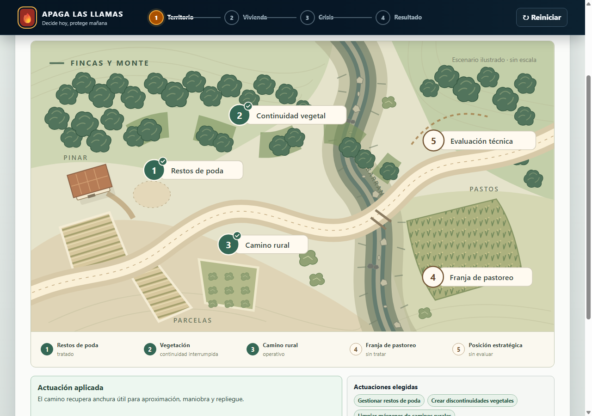
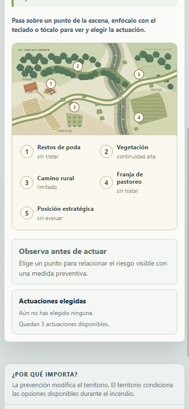
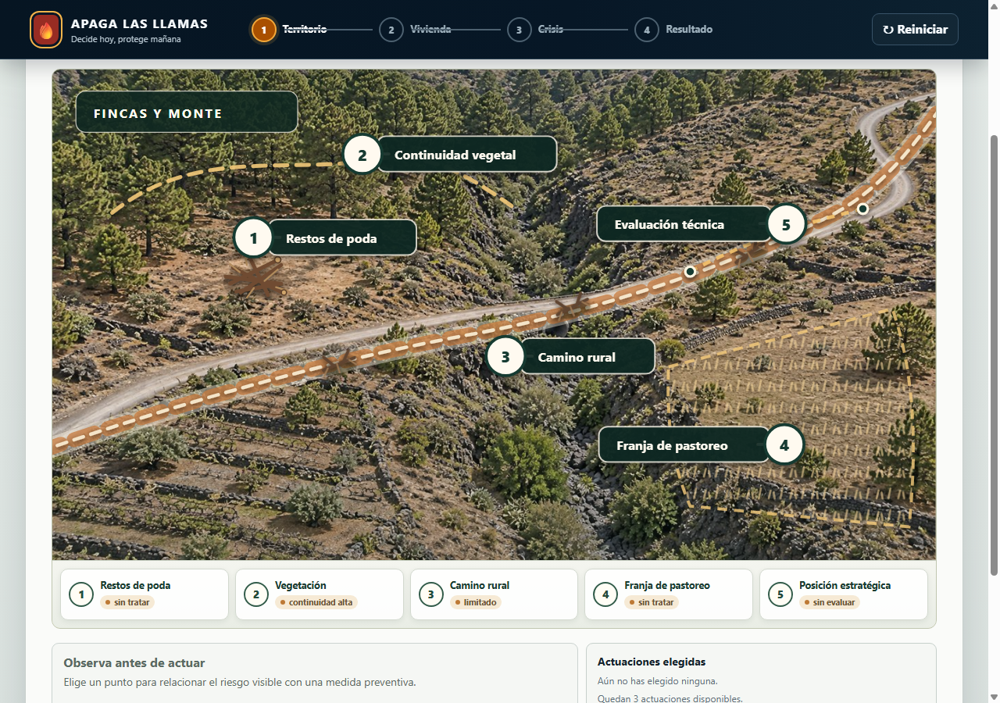
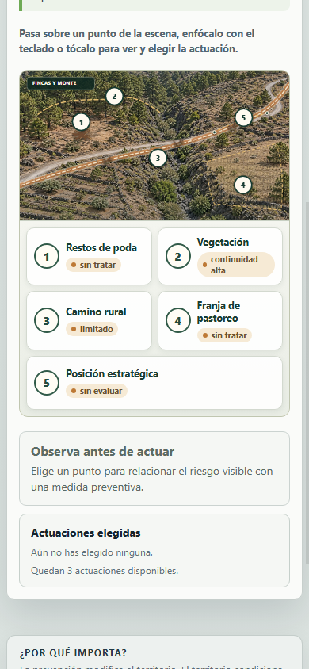
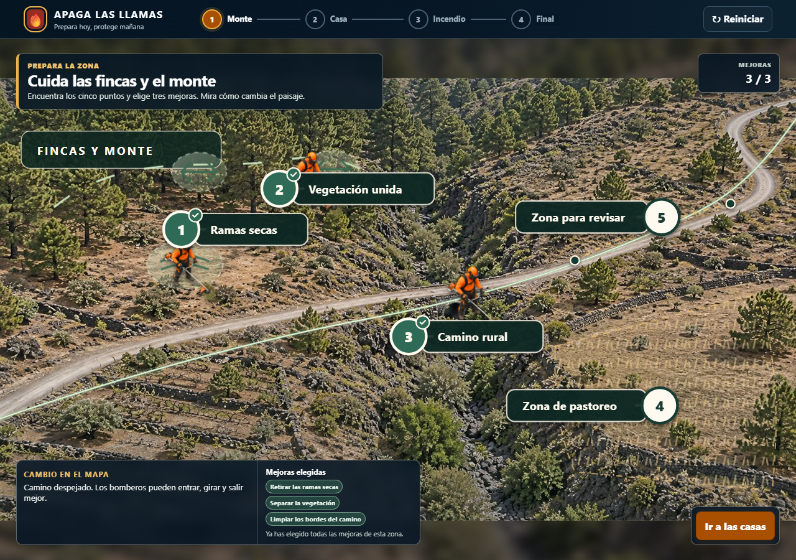
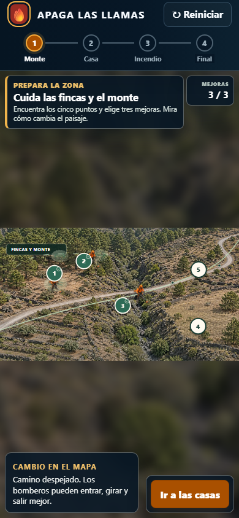
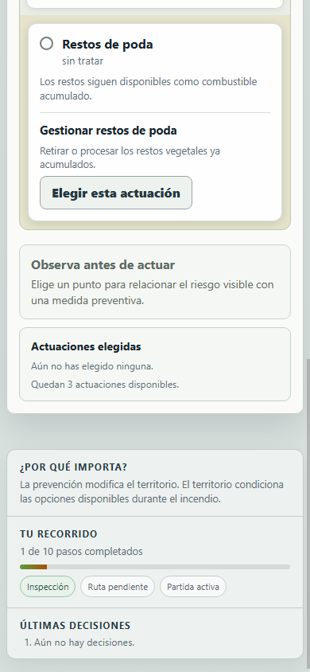
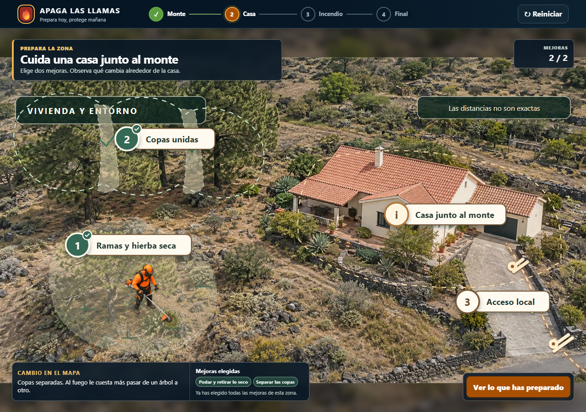
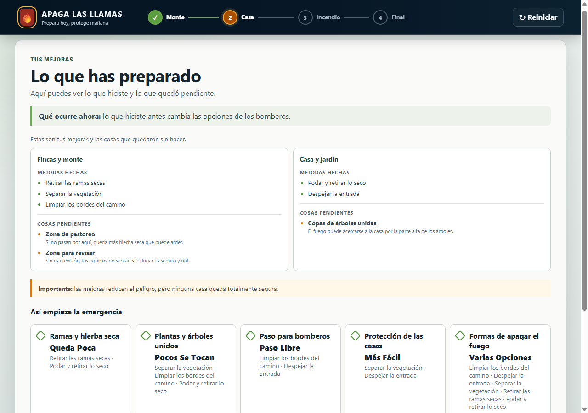

# Territorio fotográfico y controles profesionales

Issue de referencia: #176.

## Problema

El mapa vectorial permitía completar la fase, pero abstraía demasiado el relieve y colocaba los controles sobre una superficie plana. Costaba relacionar el barranco, la pista, el pinar, las parcelas y los pastos con las decisiones preventivas. La leyenda tampoco diferenciaba con suficiente jerarquía el lugar, su condición y el estado de la actuación.

## Comportamiento resultante

La escena usa una fotografía aérea original y neutral del paisaje canario. La imagen no incluye actuaciones ejecutadas: el estado real del juego sigue dibujando encima las cinco localizaciones y sus consecuencias.

- Los restos ocupan un claro real y desaparecen al gestionarlos.
- La continuidad sigue la masa de pinar y abre huecos visibles al tratarla.
- El corredor se alinea con la pista fotografiada y pasa a operativo al limpiar márgenes.
- El pastoreo queda limitado a la parcela reconocible del extremo inferior derecho.
- La evaluación técnica se representa como una medición de la ladera; no implica una quema ejecutada.

Los pines usan discos numerados estables, etiquetas oscuras de alto contraste en escritorio y áreas de interacción transparentes mayores de 44 px. En móvil se ocultan las etiquetas sobre la foto y la leyenda pasa a ser el control principal. Cada tarjeta separa nombre, condición y estado tratado/no tratado.

Las guías ya no tapan la fotografía: el eje del camino mide como máximo 1,2 px y las zonas de vegetación y pastoreo usan contornos de entre 1,5 y 2,2 px. Los textos visibles se han reescrito con frases cortas y palabras concretas para que un niño o una niña de 10 años pueda relacionar lo que ve, la mejora que elige y el cambio que produce.

## Capturas reales de navegador

Las imágenes se capturaron con Chrome mediante `Page.captureScreenshot`; no son renders aislados del SVG.

### Antes: mapa vectorial

| Escritorio | Móvil |
|---|---|
|  |  |

### Después: fotografía y estado inicial

| Escritorio | Móvil |
|---|---|
|  |  |

### Después de tres actuaciones

| Escritorio | Móvil |
|---|---|
|  |  |

### Selección táctil

### Recorrido y combinación límite

La línea de progreso queda detrás de un fondo opaco y ya no atraviesa los rótulos de las etapas.

La combinación de mayor reducción de continuidad —discontinuidades, márgenes, pastoreo, poda y separación de copas— satura el indicador en `0` y permite abrir el balance sin error.

## Validación

- Chrome real a 1280 × 900 y 390 × 844: `M5_VISUAL_SMOKE_OK`.
- Cinco pines y cinco controles; áreas interactivas de al menos 44 px.
- Tarjetas de leyenda de al menos 64 px en escritorio y 66 px en móvil.
- Pines, rótulos visibles y tarjetas sin solapamientos ni recortes.
- Guías del camino, la vegetación, el pastoreo y la zona para revisar por debajo de 2,3 px; el halo del camino no supera 7 px.
- La pila de restos ocupa menos del 14 % del ancho y del 16 % del alto del mapa.
- Ratón, teclado y toque abren las tarjetas y permiten elegir acciones.
- Se conserva el límite de tres actuaciones y el avance a vivienda, crisis y resultado.
- Las 30 combinaciones legales de tres actuaciones territoriales y dos de vivienda producen dimensiones enteras entre 0 y 100.
- `npm run accept:m5`: 200 pruebas Vitest, aceptación M4 y M5, tipos, compilación y auditoría de dependencias en verde.

## Alcance y reversión

No cambian el motor, las acciones, el presupuesto ni las consecuencias. La fotografía es una base neutral; todos los cambios visibles proceden del presentador. Para volver al mapa anterior se puede revertir el commit de esta entrega, incluidos los dos recursos raster y las reglas visuales asociadas.
