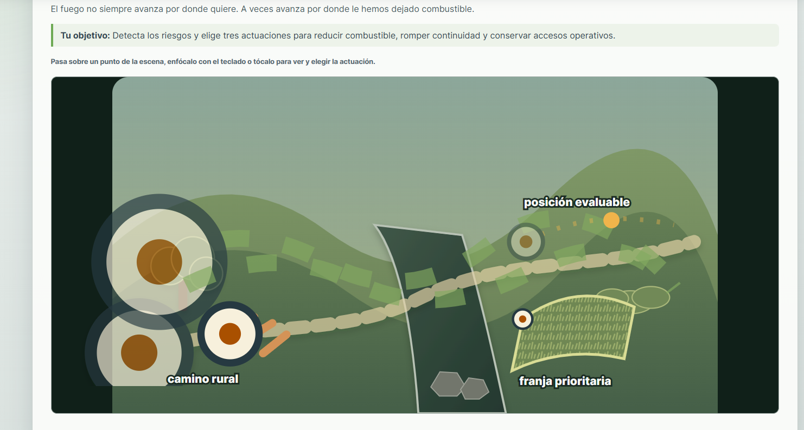
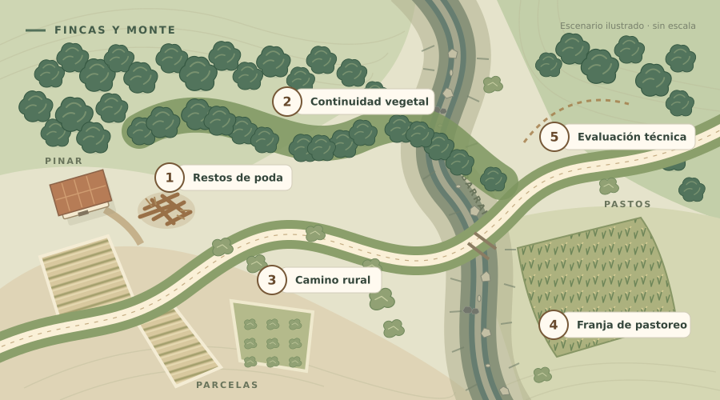
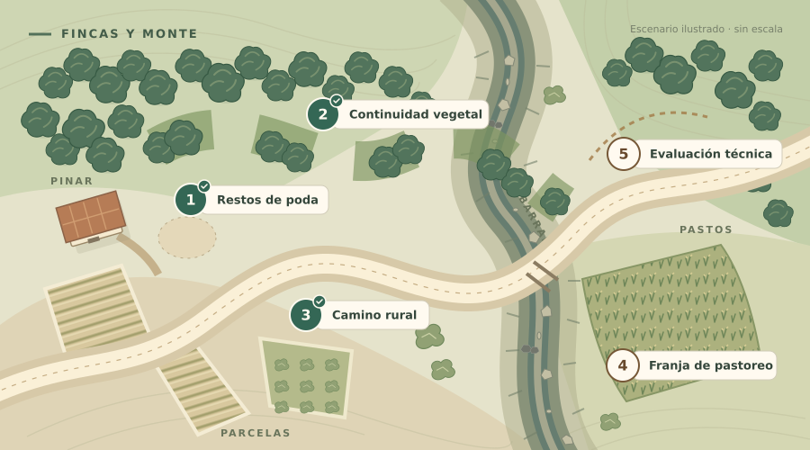
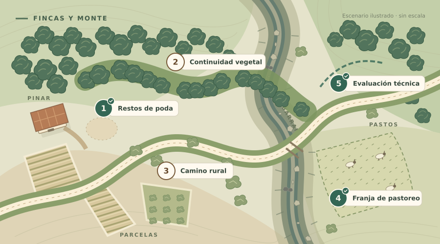

# Mapa de prevención de fincas y monte

Issue: #189.

El mapa se redibuja como una vista ilustrada desde arriba. Pinar, parcelas agrícolas, barranco y camino tienen materiales y formas distintos. Los cinco puntos mantienen las acciones y los estados del presentador existente.

## Antes

La captura aportada muestra rótulos sobre capas superpuestas y marcadores demasiado grandes. El marcador SVG usaba la unidad implícita `strokeWidth`, por lo que un trazo grueso multiplicaba su tamaño.

## Nuevo mapa

Los marcadores usan coordenadas propias; el marcador compartido declara `markerUnits="userSpaceOnUse"`. Cada punto tiene número, rótulo y control equivalente en la leyenda. En móvil, la leyenda ofrece botones de al menos 52 px de alto y las tarjetas se muestran debajo del mapa.

Las actuaciones producen cambios concretos:

- Gestión de restos: desaparece la pila de poda.
- Discontinuidad vegetal: se abren huecos entre grupos de vegetación.
- Limpieza de márgenes: desaparecen los arbustos del corredor y aumenta su anchura útil.
- Pastoreo: el combustible fino se representa más corto y aparece el rebaño.
- Evaluación técnica: cambia el trazado de la posición, que sigue representando una evaluación, no una quema ejecutada ni una garantía de seguridad.

## Validación

- Comprobación de tipos y compilación de TypeScript.
- Suite Vitest del proyecto: 193 pruebas.
- Regresión para el tamaño del marcador compartido.
- Comprobación del DOM con el cliente real y respuestas de `buildApp().inject()`: cinco controles de leyenda, apertura con Enter, selección de tres acciones, conservación de estados sin tratar y avance a vivienda. Se omiten los estilos internos del SVG por una limitación del parser de Happy DOM; no simula distribución visual.
- Las imágenes nuevas son renders SVG con Sharp/libvips, no capturas de navegador. Se inspeccionaron los tres estados.
- La prueba visual completa en navegador local no se pudo ejecutar en esta sesión: el navegador remoto bloquea direcciones locales. El workflow existente ejecuta la prueba de navegador y conserva las capturas como artefactos de CI.

El SVG se identifica como grupo accesible para conservar la semántica de sus botones. El rótulo de posición estratégica es neutro; su estado especifica si está evaluada.

## Alcance y reversión

No cambian el motor, las acciones, los recursos disponibles ni las consecuencias. La corrección de tamaño del marcador también alcanza a vivienda y crisis, que comparten el mismo recurso. Revertir el commit de esta propuesta recupera el dibujo y la presentación anteriores.
