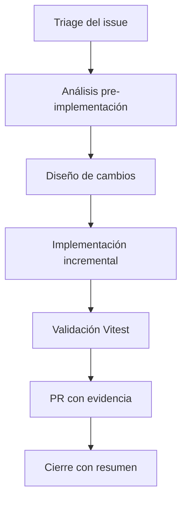

# Alineación con Playbook IA

## Principios operativos

- GitHub como fuente de verdad para decisiones y evidencia.
- Documentación y comunicación en Markdown.
- Trabajo por issues con trazabilidad de rama/PR.
- Validación por entornos: dev → staging → producción.

## Flujo de ejecución IA

## Evidencia mínima por issue

- Resumen de decisión técnica.
- Enlace a PR y ejecución CI.
- Riesgo y rollback.
- Resultado de pruebas Vitest.

