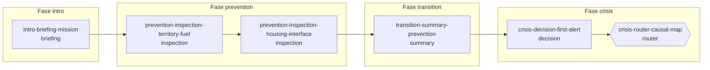

# Vertical Beta 1 — Tronco común y fases del grafo

- Fecha: 14 de agosto de 2026
- Issue: #24
- Issue padre: #14
- Entrada normativa: #23 y `docs/product/vertical-beta-1-catalog.md`
- Estado contrastado: `main@19333e640ff62b463745f7b68e5dfe827d38c6ea`

## 1. Propósito

Este documento fija el recorrido común de la Vertical Beta 1 desde el inicio de la sesión hasta el punto en el que el estado heredado selecciona una rama de crisis.

El tronco común tiene exactamente seis nodos funcionales. Es lineal hasta `crisis-router-causal-map`: antes de ese nodo no existe ninguna bifurcación, selección manual de ruta ni modo alternativo.

## 2. Alcance

Esta entrega define:

- el nodo inicial y el punto de bifurcación;
- el orden canónico de los seis nodos comunes;
- la fase y el tipo de cada nodo;
- su propósito dentro de la partida;
- la condición mínima de entrada y de avance;
- la salida canónica de cada nodo;
- las transiciones entre fases;
- las exclusiones e invariantes del tronco común.

Esta entrega no define los umbrales que seleccionan una rama, los detalles internos de las dos ramas ni la implementación del runtime. Esos trabajos corresponden respectivamente a #26, #25 y M2.

## 3. Diagrama normativo

`intro-briefing-mission` es la única entrada. `crisis-router-causal-map` es el primer y único punto de bifurcación del recorrido común.

El router no es un menú para el jugador. Consume el estado causal acumulado y produce automáticamente una de estas dos salidas oficiales:

- `crisis-decision-emergency-fuel-break`, para la rama preparada;
- `crisis-decision-access-blockage`, para la rama vulnerable.

La estructura de ambas ramas se documenta en #25 y sus predicados deterministas en [`vertical-beta-1-graph-transitions.md`](vertical-beta-1-graph-transitions.md), entrega de #26.

## 4. Tabla de nodos y avance

| Orden | Fase | ID canónico | Tipo | Propósito | Condición de entrada | Condición de avance | Salida canónica |
|---:|---|---|---|---|---|---|---|
| 1 | `intro` | `intro-briefing-mission` | `briefing` | Presentar el municipio, el objetivo educativo y el vínculo entre prevención y crisis. | Sesión creada con este nodo como `currentSceneId`. | El jugador confirma que desea comenzar. El nodo no modifica el estado causal. | `prevention-inspection-territory-fuel` |
| 2 | `prevention` | `prevention-inspection-territory-fuel` | `inspection` | Priorizar actuaciones sobre combustible, continuidad vegetal, márgenes, pastoreo y línea preventiva. | Briefing completado. | Se han registrado exactamente tres selecciones válidas entre las cinco actuaciones oficiales y se completa la inspección. | `prevention-inspection-housing-interface` |
| 3 | `prevention` | `prevention-inspection-housing-interface` | `inspection` | Priorizar actuaciones sobre continuidad próxima a viviendas, copas y acceso de autobombas. | Inspección territorial completada. | Se han registrado exactamente dos selecciones válidas entre las tres actuaciones oficiales y se completa la inspección. | `transition-summary-prevention` |
| 4 | `transition` | `transition-summary-prevention` | `summary` | Consolidar las decisiones preventivas y presentar combustible, continuidad, accesos, defensibilidad y oportunidad de ataque. | Las dos inspecciones oficiales están completas. | Existe un `inheritedState` coherente con las decisiones registradas y el jugador confirma el balance. | `crisis-decision-first-alert` |
| 5 | `crisis` | `crisis-decision-first-alert` | `decision` | Iniciar la crisis y resolver la primera respuesta ante el incendio. | Balance preventivo completado e `inheritedState` disponible. | La decisión se resuelve, sus efectos e historial quedan registrados y la escena se completa. | `crisis-router-causal-map` |
| 6 | `crisis` | `crisis-router-causal-map` | `router` | Interpretar el estado heredado y seleccionar automáticamente la rama causal. | Primer aviso completado e `inheritedState` válido. | Se determina exactamente una rama mediante las condiciones de #26; el jugador no elige la ruta. | `crisis-decision-emergency-fuel-break` o `crisis-decision-access-blockage` |

Las condiciones de esta tabla fijan la estructura y los datos mínimos necesarios. Los valores, combinaciones y umbrales causales quedan expresados como predicados deterministas y sin solapamientos en [`vertical-beta-1-graph-transitions.md`](vertical-beta-1-graph-transitions.md).

## 5. Transiciones de fase

| Transición | Arista | Regla |
|---|---|---|
| Inicio → `intro` | creación de sesión → `intro-briefing-mission` | Toda partida comienza en el briefing. |
| `intro` → `prevention` | `intro-briefing-mission` → `prevention-inspection-territory-fuel` | Continuar desde el briefing no altera el estado causal. |
| Permanencia en `prevention` | `prevention-inspection-territory-fuel` → `prevention-inspection-housing-interface` | La inspección territorial siempre precede a la de vivienda. |
| `prevention` → `transition` | `prevention-inspection-housing-interface` → `transition-summary-prevention` | Solo ocurre después de completar las dos inspecciones oficiales. |
| `transition` → `crisis` | `transition-summary-prevention` → `crisis-decision-first-alert` | Requiere que el estado preventivo haya sido consolidado. |
| Permanencia en `crisis` | `crisis-decision-first-alert` → `crisis-router-causal-map` | El primer aviso siempre precede a la selección causal de rama. |
| Tronco común → rama | `crisis-router-causal-map` → apertura preparada o vulnerable | Es la única bifurcación; la selección es automática. |

## 6. Responsabilidad causal de cada nodo

| Nodo | Consume | Produce o registra | No debe hacer |
|---|---|---|---|
| `intro-briefing-mission` | Contexto editorial | Inicio y avance de sesión | Modificar métricas, recursos o `inheritedState` |
| `prevention-inspection-territory-fuel` | Cinco actuaciones territoriales | Tres decisiones preventivas | Crear una ruta alternativa o una puntuación global |
| `prevention-inspection-housing-interface` | Tres actuaciones de interfaz | Dos decisiones preventivas | Recuperar contenidos domésticos excluidos del MVP |
| `transition-summary-prevention` | Decisiones de las dos inspecciones | Balance e `inheritedState` | Seleccionar la rama de crisis |
| `crisis-decision-first-alert` | Balance e `inheritedState` | Primera decisión y sus efectos | Priorizar una ruta de comunicación |
| `crisis-router-causal-map` | `inheritedState`; completar el primer aviso solo habilita el avance | Rama `prepared` o `vulnerable` | Usar los efectos del primer aviso para sustituir el estado heredado, pedir al jugador que elija rama o aplicar un fallback silencioso |

## 7. Invariantes y exclusiones

El tronco común cumple obligatoriamente estas reglas:

1. contiene exactamente los seis IDs de la tabla y en ese orden;
2. tiene una única entrada y no contiene ciclos;
3. no tiene bifurcaciones antes de `crisis-router-causal-map`;
4. contiene únicamente dos inspecciones preventivas;
5. no incluye `p-003-comunidad-preparada`;
6. no incluye `invierno_1`, `invierno_2`, `invierno_3` ni ningún nodo `verano_*`;
7. no incluye `s-000b-avatar-emergencias` ni otro nodo obligatorio de avatar;
8. una preferencia visual de avatar puede configurarse fuera del grafo, pero no bloquea el inicio, no modifica estado causal y no crea una transición;
9. ninguna escena de biblioteca o archivo puede usarse como salida del tronco común;
10. el router solo puede salir hacia la apertura preparada o vulnerable aprobadas en #23.

## 8. Evidencia ejecutable existente

La especificación de contrato de `GameSession` ya contiene evidencia que debe permanecer alineada con este documento:

- `tests/support/game-session-contract.ts` declara las cinco aristas lineales del tronco común y las dos salidas posibles del router;
- `tests/fixtures/game-session/coverage.json` asigna a los seis nodos sus fases y tipos canónicos;
- `tests/fixtures/game-session/initial.json` comienza en `intro-briefing-mission`;
- `tests/fixtures/game-session/prevention-completed.json` demuestra el orden briefing → territorio → vivienda → balance;
- `tests/fixtures/game-session/completed-contained.json` recorre el tronco común completo antes de entrar en la rama preparada.

Estos artefactos son una especificación ejecutable de M1, no el motor del juego. La implementación de flujo y avance corresponde a #68–#76.

## 9. Matriz de aceptación de #24

| Criterio | Evidencia | Estado |
|---|---|---|
| Inicio y punto de bifurcación definidos | Diagrama y secciones 3–4 | Cumplido |
| Seis nodos comunes con IDs de #23 | Tabla de la sección 4 | Cumplido |
| Orden coherente con #22 y #59 | Diagrama, tabla y catálogo canónico | Cumplido |
| Sin `p-003` ni nodos `invierno_*` | Invariantes 4–6 | Cumplido |
| Avatar opcional fuera del flujo | Invariantes 7–8 | Cumplido |
| Sin bifurcaciones innecesarias en prevención | Diagrama e invariantes 2–3 | Cumplido |

## 10. Entregas siguientes

- #25 documenta las ramas preparada y vulnerable y su convergencia en [`vertical-beta-1-crisis-branches.md`](vertical-beta-1-crisis-branches.md);
- #26 documenta las condiciones, prioridades y estados inválidos en [`vertical-beta-1-graph-transitions.md`](vertical-beta-1-graph-transitions.md);
- #27 valida alcanzabilidad, ausencia de ciclos y formato declarativo en [`vertical-beta-1-graph-validation.md`](vertical-beta-1-graph-validation.md);
- #44 fija el contexto inmutable de las dos partidas en [`vertical-beta-1-reference-common.md`](vertical-beta-1-reference-common.md);
- #68 implementará el contrato común `GameScene` y el validador del catálogo cuando M1 esté listo.
