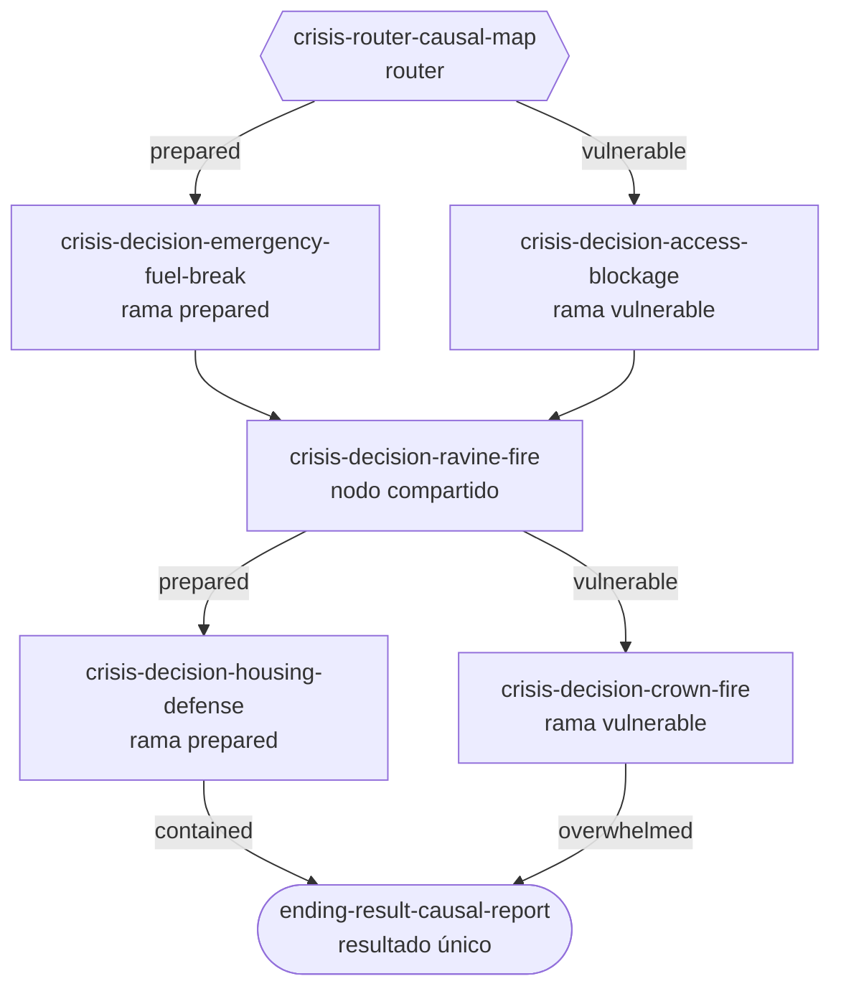

# Vertical Beta 1 — Ramas y convergencias de crisis

- Fecha: 14 de agosto de 2026
- Issue: #25
- Issue padre: #14
- Entradas normativas: #23, #24 y `docs/product/vertical-beta-1-catalog.md`
- Estado contrastado: `main@78afed80273204249bf267c89472f782b23d357a`

## 1. Propósito

Este documento fija las dos únicas ramas causales de crisis de la Vertical Beta 1, sus diferencias visibles, el uso compartido del barranco y su convergencia en un único nodo final.

El router no ofrece una elección al jugador. Selecciona automáticamente `prepared` o `vulnerable` a partir de `inheritedState`, según los predicados deterministas de [`vertical-beta-1-graph-transitions.md`](vertical-beta-1-graph-transitions.md), entrega de #26.

## 2. Alcance

Esta entrega define:

- las dos salidas canónicas de `crisis-router-causal-map`;
- los tres nodos de decisión que recorre cada rama;
- la convergencia estructural en `crisis-decision-ravine-fire`;
- la conservación de la identidad de rama al salir del barranco;
- las diferencias visibles entre ambas partidas;
- la convergencia final en `ending-result-causal-report`;
- las exclusiones e invariantes del recorrido de crisis.

Esta entrega no fija umbrales, prioridades ni reglas de fallback. Tampoco implementa el router, las variantes de las escenas o el cálculo del resultado. Esos trabajos corresponden a #26 y M2.

## 3. Mapa normativo



El diagrama contiene una sola instancia funcional de `crisis-decision-ravine-fire` y una sola instancia de `ending-result-causal-report`. Las etiquetas `prepared`, `vulnerable`, `contained` y `overwhelmed` son estado o variantes calculadas, no IDs de escena adicionales.

## 4. Recorridos canónicos

### Rama preparada

```text
crisis-router-causal-map [prepared]
→ crisis-decision-emergency-fuel-break
→ crisis-decision-ravine-fire
→ crisis-decision-housing-defense
→ ending-result-causal-report [contained]
```

Esta rama expresa que la prevención no evita el incendio, pero conserva accesos, posiciones seguras y oportunidades de ataque suficientes para mantenerlo dentro de la capacidad de extinción.

### Rama vulnerable

```text
crisis-router-causal-map [vulnerable]
→ crisis-decision-access-blockage
→ crisis-decision-ravine-fire
→ crisis-decision-crown-fire
→ ending-result-causal-report [overwhelmed]
```

Esta rama expresa que la continuidad del combustible y la falta de acceso eliminan oportunidades de ataque hasta que el incendio supera la capacidad de extinción.

## 5. Tabla estructural de nodos

| Posición | Rama | ID canónico | Función estructural | Entrada | Salida |
|---:|---|---|---|---|---|
| 6 | Ambas | `crisis-router-causal-map` | Seleccionar automáticamente una rama y conservarla en la sesión. | Tronco común completado e `inheritedState` válido. | Apertura preparada o vulnerable. |
| 7A | Preparada | `crisis-decision-emergency-fuel-break` | Abrir una maniobra técnica habilitada por la preparación previa. | `crisisBranch = prepared`. | `crisis-decision-ravine-fire` |
| 7B | Vulnerable | `crisis-decision-access-blockage` | Mostrar la pérdida de margen operativo causada por accesos deficientes. | `crisisBranch = vulnerable`. | `crisis-decision-ravine-fire` |
| 8 | Ambas | `crisis-decision-ravine-fire` | Someter ambas partidas al mismo problema orográfico con condiciones distintas. | Una de las dos aperturas completada y rama conservada. | Defensa de viviendas si `prepared`; fuego de copas si `vulnerable`. |
| 9A | Preparada | `crisis-decision-housing-defense` | Resolver una defensa operativa viable sin eliminar el riesgo. | Barranco completado con rama `prepared`. | `ending-result-causal-report [contained]` |
| 9B | Vulnerable | `crisis-decision-crown-fire` | Mostrar la pérdida de seguridad y capacidad de ataque. | Barranco completado con rama `vulnerable`. | `ending-result-causal-report [overwhelmed]` |
| 10 | Ambas | `ending-result-causal-report` | Explicar el resultado desde el historial causal de la partida. | Escena de cierre de cualquiera de las dos ramas completada. | Terminal. |

Cada ruta contiene exactamente tres decisiones de crisis después del router. El barranco cuenta una sola vez en el catálogo aunque sea alcanzable desde ambas aperturas.

## 6. Diferencias visibles obligatorias

| Momento | Rama preparada | Rama vulnerable |
|---|---|---|
| Apertura | Aparece `crisis-decision-emergency-fuel-break`: existe una posición desde la que valorar una maniobra técnica. | Aparece `crisis-decision-access-blockage`: el estado de caminos y márgenes retrasa o limita la entrada de medios. |
| Barranco compartido | El contexto debe mostrar accesos utilizables, rutas de escape u oportunidades para consolidar el ataque. | El mismo terreno debe mostrar más combustible, menos acceso y menos posiciones seguras. |
| Opciones y respuesta | Las opciones compatibles con una oportunidad de ataque pueden permanecer disponibles y producir feedback de control exigente. | Las opciones incompatibles con la seguridad deben quedar condicionadas, desaconsejadas o producir feedback de repliegue. |
| Cierre de crisis | Aparece `crisis-decision-housing-defense`: la defensa de estructuras sigue siendo operativamente viable. | Aparece `crisis-decision-crown-fire`: la continuidad vertical y horizontal hace inseguro el ataque directo. |
| Resultado | El nodo final presenta la variante `contained`. | El mismo nodo final presenta la variante `overwhelmed`. |

Las diferencias deben proceder de decisiones preventivas registradas, no de azar ni de una elección manual de rama. #26 fija las condiciones exactas y #35 aporta los efectos aprobados de `inheritedState` durante la crisis.

## 7. Contrato del nodo compartido

`crisis-decision-ravine-fire` es una única escena funcional con un único ID y una única fuente editorial.

Al entrar en el nodo:

1. `crisisBranch` ya está definida y no puede cambiar;
2. `inheritedState` conserva las cinco dimensiones causales;
3. el historial identifica la apertura desde la que se llegó;
4. el contenido puede adaptar contexto, disponibilidad, feedback y consecuencias;
5. la salida se determina por la rama conservada, no por una segunda selección.

El nodo compartido no puede:

- duplicarse como variantes `prepared` y `vulnerable` con IDs distintos;
- recalcular o sustituir la rama;
- conducir desde `prepared` a `crisis-decision-crown-fire`;
- conducir desde `vulnerable` a `crisis-decision-housing-defense`;
- introducir una ruta de comunicación, evacuación o defensa nocturna.

## 8. Convergencia final

Ambas rutas terminan en `ending-result-causal-report`. El resultado calculado se expresa mediante una variante:

- `contained`, si la sesión conserva la rama preparada hasta el cierre;
- `overwhelmed`, si la sesión conserva la rama vulnerable hasta el cierre.

No existen nodos separados como `ending-contained` o `ending-overwhelmed`. El nodo final presenta el resultado calculado y su explicación causal; no decide la variante por sí mismo.

## 9. Invariantes y exclusiones

1. solo existen las ramas `prepared` y `vulnerable`;
2. ambas parten de `crisis-router-causal-map`;
3. la selección de rama es automática y determinista;
4. cada rama contiene tres decisiones de crisis;
5. `crisis-decision-ravine-fire` es compartido y no se duplica;
6. la rama seleccionada se conserva durante todo el recorrido de crisis;
7. ambas rutas convergen en un único nodo terminal;
8. solo existen las variantes de resultado `contained` y `overwhelmed`;
9. no existe una tercera rama, un tercer desenlace ni un fallback genérico;
10. comunicación, 112, evacuación, senderistas y defensa nocturna no forman rutas del MVP;
11. ninguna escena de biblioteca o archivo puede aparecer como transición;
12. un estado que no pueda seleccionar exactamente una rama debe producir un error verificable, no una ruta silenciosa.

## 10. Evidencia ejecutable existente

La especificación de contrato de `GameSession` ya contiene evidencia alineada con este mapa:

- `tests/support/game-session-contract.ts` declara las dos salidas del router, la convergencia en el barranco, las dos salidas condicionadas y la convergencia final;
- `tests/fixtures/game-session/crisis-prepared.json` conserva `crisisBranch = prepared` al llegar al barranco;
- `tests/fixtures/game-session/completed-contained.json` recorre la rama preparada hasta `contained`;
- `tests/game-session-contract.test.ts` construye una sesión vulnerable completa y valida `crisisBranch = vulnerable` con resultado `overwhelmed`;
- `docs/domain/game-session-serialization.md` confirma que ambas variantes usan el mismo contrato de sesión.

Estos artefactos validan forma, recorrido e invariantes de M1. No implementan todavía la selección causal, la adaptación del contenido ni el cálculo de resultado de M2.

## 11. Matriz de aceptación de #25

| Criterio | Evidencia | Estado |
|---|---|---|
| Solo ramas preparada y vulnerable | Mapa e invariantes 1–3 | Cumplido |
| Ambas alcanzables desde el mismo router | Mapa y tabla estructural | Cumplido |
| Diferencias preventivas visibles | Sección 6 | Cumplido |
| Barranco compartido sin duplicación | Mapa y sección 7 | Cumplido |
| Convergencia en `ending-result-causal-report` | Mapa y sección 8 | Cumplido |
| Sin tercer desenlace ni comunicación paralela | Invariantes 8–11 | Cumplido |

## 12. Entregas siguientes

- #26 especifica predicados, prioridad, conservación de rama y errores de estado en [`vertical-beta-1-graph-transitions.md`](vertical-beta-1-graph-transitions.md);
- #27 validará alcanzabilidad, convergencias, ausencia de ciclos y formato declarativo;
- #35 aporta los efectos de `inheritedState` que condicionan la experiencia de crisis;
- #68 implementará el contrato común y el validador del grafo cuando M1 esté listo.
