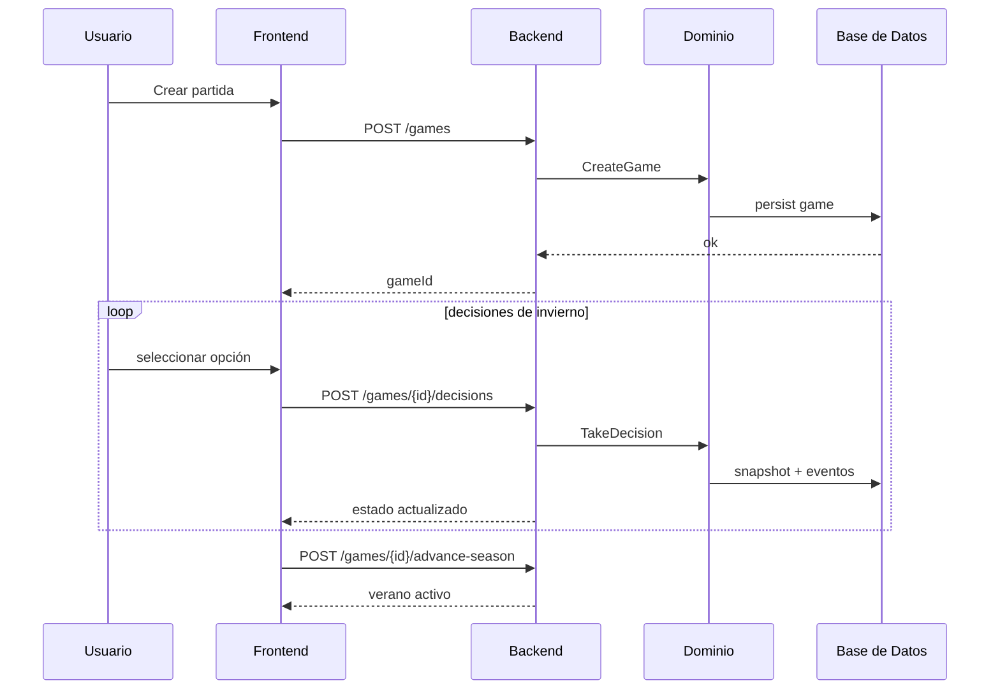

# Especificación Funcional y Técnica Integral

## Alcance funcional

1. Gestión de partida por ciclos estacionales.
2. Árbol de decisiones con costes, requisitos y efectos.
3. Simulación de incendio dependiente de heurística acumulada.
4. Visualización geoespacial de riesgo y propagación.
5. Post-mortem con historial y análisis de impacto.

## Requisitos funcionales (RF)

- **RF-01**: crear partida desde escenario.
- **RF-02**: ejecutar decisiones de invierno con validación de recursos.
- **RF-03**: transición automática a verano según criterio de cierre.
- **RF-04**: calcular propagación y exponer estado de incendio.
- **RF-05**: registrar historial de decisiones y recursos.

## Requisitos no funcionales (RNF)

- **RNF-01**: trazabilidad en GitHub por issue/PR.
- **RNF-02**: cobertura de pruebas >= 80% en Vitest.
- **RNF-03**: contratos API estables y versionados.
- **RNF-04**: tiempos de respuesta aceptables en rutas críticas.

## Criterios de aceptación por capability

| Capability | Criterio | Evidencia |
|---|---|---|
| Partida | Se crea y persiste sesión válida | Test integración Vitest |
| Decisión | Rechaza recursos insuficientes | Test unitario + negativo |
| Transición | Invierno->Verano coherente | Test integración |
| Heatmap | API devuelve GeoJSON válido | Test contrato |
| Historial | Snapshot por decisión | Test integración |

## Flujo funcional end-to-end

