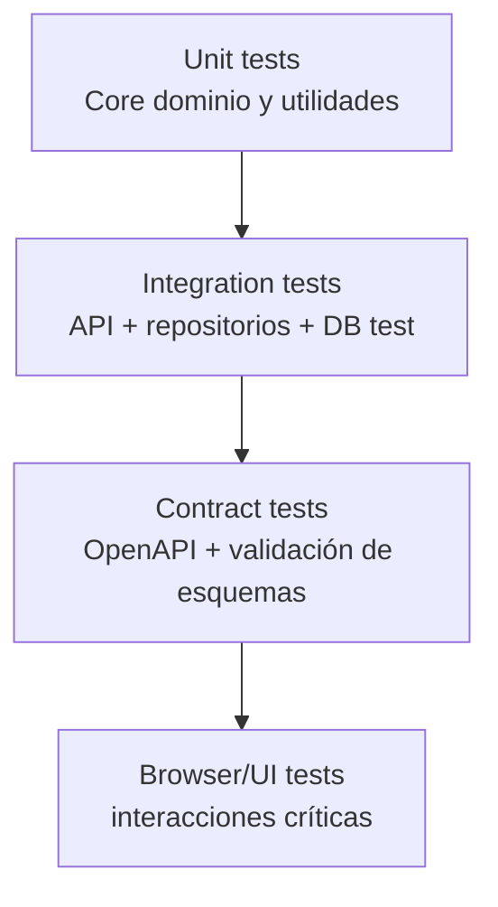

# Estrategia de Testing Unificada (Vitest)

## Política oficial

Todas las pruebas del proyecto se ejecutan con **Vitest**.

Se elimina la mezcla de frameworks en nueva documentación (Jest/Cypress) para evitar duplicidades de configuración, reporte y mantenimiento.

## Pirámide de pruebas

## Proyectos Vitest recomendados

- `unit`: lógica pura y componentes aislados.
- `integration`: rutas API, repositorios, adaptadores.
- `contract`: validación de payloads contra contrato.
- `browser`: flujos UI críticos con entorno browser.

## Criterios mínimos

- Cobertura global objetivo: `>= 80%` (líneas/funciones/branches).
- Cualquier bug P0/P1 debe incluir test de regresión.
- Cambios de contrato deben añadir test negativo (errores esperados).

## Comandos documentados

- `npm run test`
- `npm run test:unit`
- `npm run test:integration`
- `npm run test:contract`
- `npm run test:browser`
- `npm run test:coverage`

## Evidencia para GitHub

- Incluir enlace al run de CI por cada PR.
- No pegar logs masivos en comentarios.
- Resumir resultado y adjuntar extracto breve.

