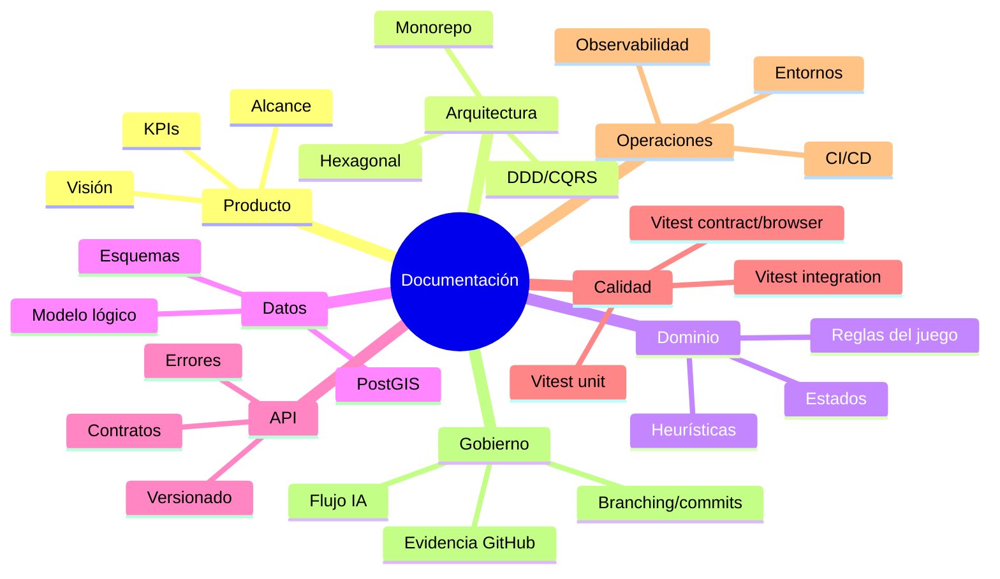

# Plan de Documentación Integral

## Objetivo

Estructurar la documentación del proyecto para ejecución asistida por IA, con trazabilidad completa en GitHub y artefactos Markdown enlazados desde [README.md](../../README.md).

## Estructura objetivo

## Criterios de completitud

- Índice maestro y enlaces relativos funcionales.
- Decisiones técnicas justificadas y actualizadas.
- Pruebas unificadas en Vitest.
- Gaps, riesgos, dudas y backlog pendiente explicitados.
- Plantillas para PR, scripts y clases listas para uso por IA.

## Entregables

- Índice central: [docs/README.md](../../docs/README.md)
- Contribución: [CONTRIBUTING.md](../../CONTRIBUTING.md)
- Especificaciones y gestión: carpeta [docs](../../docs/)

